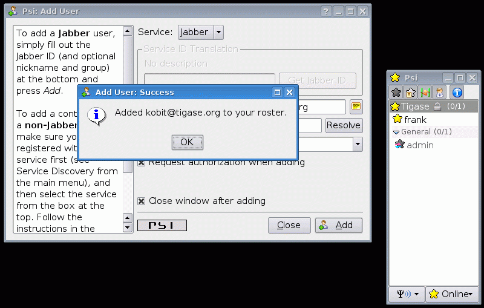
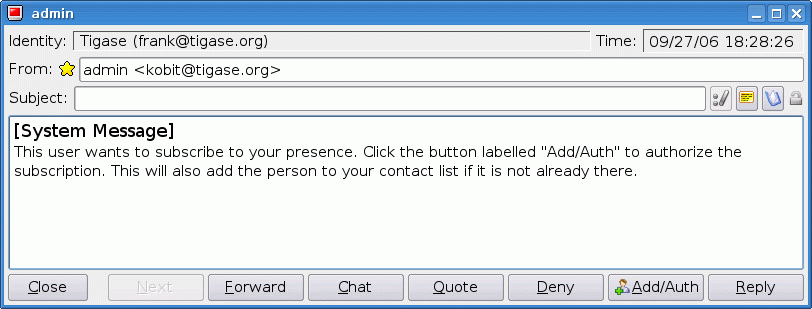

2. Tigase XMPP Server Distribution Administration Guide
=======================================================

2.1. Tigase User Guide
-----------------------

2.1.1. Jabber/XMPP introduction
^^^^^^^^^^^^^^^^^^^^^^^^^^^^^^^
Jabber/XMPP is Instant Messaging Technology
~~~~~~~~~~~~~~~~~~~~~~~~~~~~~~~~~~~~~~~~~~~
All federated **XMPP** servers are connected in one global communications network allowing you to send messages to friends who have accounts on other Jabber servers.

This is very much like sending e-mail but the difference between Jabber and e-mail is the same as the difference between sending a traditional mail and talking on the phone.

All messages sent through Jabber are sent instantly and you also receive responses instantly. More over you can see whether your mate is online and available for talking or not.

There exists similar technologies to Jabber like WhatsApp Messenger, Facebook Messenger, Signal, Telegram, WeChat, QQ and other. There are, however, quite a few differences.

XMPP is an open standard which means everybody can know how it works, everybody can implement their own software connecting to the network both client and server side.

The server side is actually the biggest difference and advantage. Many companies have offices in different locations, and such instant messaging technology could be very useful to employees for communication. Companies are not inclined to allow confidential discussions to go outside the company’s network. Especially if it is not very secure to leave such information on third party public servers.

XMPP servers on the other hand, allows you to deploy server software on your own company network. Employees can then talk securely and all information remains on the company’s secure network. Of course if offices are located in different locations or countries then all messages are transmitted over the public network - the Internet. This is not a problem since XMPP supports SSL/TLS - secure encrypted connections which helps you protect your discussion.

Then if your employees need to contact customers outside your company, the whole discussion can go through your server and a server located on the customer side.

There are many other scenarios and use cases but I hope this brief introduction gives you an idea of the differences and advantages of XMPP technology.

2.1.2. How to Use Tigase Service
^^^^^^^^^^^^^^^^^^^^^^^^^^^^^^^^

This Article Describes How to use **tigase.im** Service for Instant Communications
~~~~~~~~~~~~~~~~~~~~~~~~~~~~~~~~~~~~~~~~~~~~~~~~~~~~~~~~~~~~~~~~~~~~~~~~~~~~~~~~~~~

You have to install and run a Jabber client application to use the service.

There are multiple domains available: tigase.im, sure.im, xmpp.cloud (and you can host your own domain as well)

Short instructions:
~~~~~~~~~~~~~~~~~~~

Usually you just need to enter the user name of the form: user@tigase.im. Your XMPP client should take care of all other things as our service doesn’t need any special settings. If you don’t have an account on tigase.im server yet just tick the option to register new account. That’s it!

**Long Instructions:**
~~~~~~~~~~~~~~~~~~~~~~

Good news is that there are many programs to choose from which allow you to communicate through our server. So you can pick up your favorite application or use an existing one that is compatible and start using our service.

All clients presented below support multiple accounts on Jabber servers. What this means is that you can have a few Jabber accounts on different Jabber servers and you can still use just one program to connect to all of them at the same time.

The `full list of all known XMPP clients <https://xmpp.org/software/clients.html>`__ is very long. You can obviously try them all but below is a selection which is recommended by the Tigase team. The selected programs might not be the best choice for you, but these programs have been tested and we can offer help with using them. Here is a list of recommended instant messaging clients:

-  `Beagle.im <https://beagle.im/>`__ - macOS desktop client developed by Tigase team supporting all the latest and greatest features

-  `Tigase Messenger for iOS <https://itunes.apple.com/us/app/tigase-messenger/id1153516838>`__ - lightweight, powerful XMPP client developed by Tigase, Inc. It provides an easy way to start using the XMPP Protocol (formerly known as Jabber) if you’ve never used it before. Veterans of the protocol will find many features here they are familiar with along with enhancements to reduce data use and extend battery life.

-  `Tigase Messenger for Android <https://play.google.com/store/apps/details?id=org.tigase.messenger.phone.pro>`__ - mobile chat client to use with XMPP services and servers. The totally revamped v3.0 now has new features, a better design, and Google integration. Application supports any XMPP server, from free services like sure.im or Tigase.im, to a server you may host on your own.

-  tigase.im[Tigase.im] - web-based client allowing to easily chat with friends independently of platform.

-  `Psi <http://psi-im.org/>`__ Pure Jabber client. Although it supports only Jabber network it is a very user friendly and comfortable program. It works on most popular operating systems like Linux, MS Windows, and Apple MacOS X.

-  `Gajim <http://www.gajim.org/>`__ This is another Jabber only client. Very user friendly and works on most of Linux distributions, FreeBSD, and MS Windows.

-  `Pidgin <http://www.pidgin.im/>`__ (previously `Gaim <http://gaim.sourceforge.net/>`__) This is not just a Jabber client. This type of application is called multicommunicator as apart from Jabber it supports many other instant messaging networks/protocols such as: AIM/ICQ, MSN, Yahoo, Gadu-Gadu, IRC, and a few others. So it is especially convenient if you have friends using other messaging networks. Pidgin works on most Linux distributions, and on MS Windows.

-  `Kopete <http://kopete.kde.org/>`__ This is a `KDE <http://www.kde.org/>`__ component and although it only works on Linux based system it also supports many of the most popular instant messaging protocols apart from Jabber like: AIM, Gadu-Gadu, ICQ, IRC, MSN, Yahoo.

Install the Jabber client of your choice and set up for a Tigase account:

2.1.3. Configuration instructions for Psi
^^^^^^^^^^^^^^^^^^^^^^^^^^^^^^^^^^^^^^^^^

Psi - Initial configuration
~~~~~~~~~~~~~~~~~~~~~~~~~~~~

The first time you run Psi you see a screen like this:

|Psi First Run|

To connect to tigase.org server we need to configure the program. Below are step-by-step instructions for novice users on how to setup Psi.

1. Psi can connect to many Jabber servers at the same time so we have to identify each connection somehow. The first thing to do is assign a name to the connection we just created. As we are going to define connection to tigase.org server let’s just name it: **Tigase**.

   |Psi Add Account|

   **Note!** At the moment you can register an account through the Web site only. This is a single account for both services: The Drupal website and Jabber/XMPP service on the tigase.org domain. If you want to have a Jabber account on the tigase.org server go to the registration page, un-tick "Register new account", and go to the point no 5. You can use guide points 2-4 to register a Jabber account on any other Jabber server.

2. When you press the Add button you will see next window where you can enter your Jabber account details:

   |Psi Empty Account|

3. Invent your user name for the account on Tigase server. Let’s assume your user name is: **frank**. Jabber ID’s however consist of 2 parts - your user name and server address. Exactly the same as an e-mail address. As you are registering an account on tigase.org server, you will have to enter in this field: **frank@tigase.org**. Next enter the password of your choice and click the Register button.

   |Psi Register Account|

4. On successful registration you will receive a confirmation message and you should see a window like this:

   |Register Account Success|

   It may happen that somebody earlier registered an account with the same name you’ve selected for yourself. If so, you will receive error message. You will then have to select another user name and try to register again.

5. After clicking the **OK** button you will see a window with your connection and account setup. You can stick with default values for now.

   |PSI After Registration|

   Just click the **Save** button and this window closes.

6. Now you have your account configured and ready to use but you are still off-line. You can find out whether you are on-line or off-line by looking at the bottom of main Psi window. There you can see **Offline** text.

   Click on this **Offline** text and you will see a list of possible options. Just select **Online**.

   |PSI Connected|

   Now you are connected!

Well, you are now connected but how to talk to other people? How to add friends to the contact list? You can send a message to your friends straight away using the **Psi menu** option **New blank message**. It is much more convenient however, if you could see which of your friends is online and available for chatting and if you could start talking to your friend just by clicking on his name.

Short Instructions How to Add Your First Contact
~~~~~~~~~~~~~~~~~~~~~~~~~~~~~~~~~~~~~~~~~~~~~~~~~~

1. Click on Psi menu - the button next to the **Online** text. You will see something like this:

   |PSI Menu|

   From all menu options select the top one - Add a contact:

   |PSI Menu add Contact|

2. The next window will display where you can enter your contact details:

   |PSI Add User Empty|

   You have to know the Jabber ID of the person you want to add to your contact list. Let’s assume, for example, you want to add Tigase server administrator’s Jabber ID to your contact list. So, after you enter these details the window will look like this:

   |PSI Add User Filled|

   Click the **Add** button.

3. Now you will see a confirmation window that a new person has been added to your contact list:

   |PSI Kobit Added|

   But there is more behind the scenes. Adding a contact to your **Roster** (contact list) usually means you can see whether the person is online and available to talk or not. The person however, may not wish you to see his presence. So, to make sure the other person accepts you as a friend Psi sent a request to the address you just entered with the question of whether he agrees to show his presence to you.

   You won’t be able to see the users availability until he sends confirmation.

4. Once the other user sends confirmation back, you will usually receive 2 system events:

   |PSI Kobit Auth Received|

5. Click on the contact to see a window with these messages:

   |PSI Authorized Window|

6. One message just says you have been authorized by the other user:

   |PSI Authorized Window 2|

   So you simply click **Next** to see the second message.

7. The second message is a bit more interesting. It contains the question of whether you also authorize the other user to see your presence. If you want to accept this request just click **Add/Auth**.

   |PSI Authorized Window 3|

8. Finally main Psi window with your new contact:

   |PSI Kobit Added Authorized|

Well done!

You are ready to start Jabbering. Good luck.

Where to go next? For detailed Psi documentation refer to the program Wiki page: http://psi-im.org/wiki/Main_Page

Welcome to the Tigase Administration Guide.

.. |Psi First Run| image:: images/user/psi-first-run.png

.. |Psi Empty Account| image:: images/user/psi-register-account-empty.png

.. |Register Account Success| image:: images/user/psi-register-account-success.png
.. |PSI After Registration| image:: images/user/psi-after-registration.png
.. |PSI Connected| image:: images/user/psi-connected.png
.. |PSI Menu| image:: images/user/psi-menu.png
.. |PSI Menu add Contact| image:: images/user/psi-menu-add-contact.png
.. |PSI Add User Empty| image:: images/user/psi-add-user-empty.png

.. |PSI Kobit Auth Received| image:: images/user/psi-kobit-auth-received.png
.. |PSI Authorized Window| image:: images/user/psi-authorized-window.png
.. |PSI Authorized Window 2| image:: images/user/psi-authorized-window-2.png

.. |PSI Kobit Added Authorized| image:: images/user/psi-kobit-added-authorized.png

2.2. About Tigase XMPP Server
-----------------------------

**Tigase XMPP Server** is an **Open Source and Free (AGPLv3)** Java based server. The goals behind its design and implementation of the server are:

1. Make the server robust and reliable.

2. Make the server a secure communication platform.

3. Make a flexible server which can be applied to different use cases.

4. Make an extensible server which takes full advantage of XMPP protocol extensibility.

5. Make the server easy to setup and maintain.

2.2.1. Robust and reliable
^^^^^^^^^^^^^^^^^^^^^^^^^^

This means that the server can handle many concurrent requests/connections and can run for a long time reliably. The server is designed and implemented to handle millions of simultaneous connections.

It is not enough however to design and implement a high load server and hope it will run well. The main focus of the project is put in into testing. Tests are taken so seriously that a dedicated testing framework has been implemented. All server functions are considered as implemented only when they pass a rigorous testing cycle. The testing cycle consists of 3 fundamental tests:

1. **Functional tests** - Checking whether the function works at all.

2. **Performance tests** - Checking whether the function performs well enough.

3. **Stability tests** - Checking whether the function behaves well in long term run. It must handle hundreds of requests a second in a several hour server run.

2.2.2. Security
^^^^^^^^^^^^^^^^

There are a few elements of the security related to XMPP servers: secure data transmissions which is met by the implementation of **SSL** or **TLS** protocol, secure user authorization which is met by the implementation of **DIGEST** or **SASL** user authorization and secure deployment which is met by component architecture.

**Secure deployment** Tigase software installation does not impact network security. Companies usually have their networks divided into 2 parts: **DMZ** which is partially open to the outside world and the **Private network** which is closed to the outside world.

If the XMPP server is to provide an effective way of communication between company employees regardless if they are in a secure company office or outside (perhaps at a customer site), it needs to accept both internal and external connections. So the natural location for the server deployment is the **DMZ**. However, this solution has some considerations: each company has normally established network users base and integrated authorization mechanisms. However, that information should be stored outside the DMZ to protect internal security, so how to maintain ease of installation and system security?

**Tigase server** offers a solution for such a case. With it’s component structure, Tigase can be easily deployed on any number machines and from the user’s point of view it is seen as a one logical XMPP server. In this case we can install a Session Manager module in the **private** network, and a Client Connection Manager with Server Connection Manager in the **DMZ**.

Session Manager connects to **DMZ** and receives all packets from external users. Thus is can securely realize users authorization based on company authorization mechanisms.

2.2.3. Flexibility
^^^^^^^^^^^^^^^^^^
There are many different XMPP server implementations. The most prevalent are:

-  Used as a business communication platform in small and medium companies where the server is not under a heavy load. For such deployments security is a key feature.

-  For huge community websites or internet portal servers is, on the other hand, usually under very heavy load and has to support thousands or millions of simultaneous connections. For such a deployment we need a different level of security as most of the service is open to the public.

-  For very small community deployments or for small home networks the key factor is ease to deploy and maintain.

Architecture based on components provides the ability to run selected modules on separate machines so the server can be easily applied in any scenario.

For simple installation the server generates a config file which can be used straight away with very few modifications or none at all. For complex deployments though, you can tweak configurations to your needs and setup XMPP server on as many physical machines as you need.

2.2.4. Extensibility
^^^^^^^^^^^^^^^^^^^^^

The world changes all the time as does user’s needs. The XMPP protocol has been designed to be extensible to make it easy to add new features and apply it to those different user’s needs. As a result, XMPP is a very effective platform not only for sending messages to other users, it can also be extended for sending instant notifications about events, a useful platform for on-line customer service, voice communication, and other cases where sending information instantly to other people is needed.

**Tigase server** has been designed to be extensible using a modular architecture. You can easily replace components which do not fulfill your requirements with others better fitting your needs. But that is not all, another factor of extensibility is how easy is to replace or add new extensions. A great deal of focus has been put into the server design API to make it easy for other software developers to create extensions and implement new features.

2.2.5. Ease of Use
^^^^^^^^^^^^^^^^^^^

Complex computer networks consisting of many servers with different services are hard to maintain. This requires employing professional staff to operate and maintain the network.

Not all networks are so complex however, most small companies have just a few servers for their needs with services like e-mail and a HTTP server. They might want to add an XMPP server to the collection of their services and don’t want to dedicate resources on setup and maintenance. For such users our default configuration is exactly what they need. If the operating system on the server is well configured, then Tigase should automatically pickup the correct hostname and be ready to operate immediately.

Tigase server is designed and implemented to allow dynamic reconfiguration during runtime so there is no need to restart the server each time you want to change configuration settings.

There are also interfaces and handlers available to make it easy to implement a web user interface for server monitoring and configuring.

2.2.6. XMPP Supported Extensions
^^^^^^^^^^^^^^^^^^^^^^^^^^^^^^^^^

Based on `XEP-0387: XMPP Compliance Suites 2018 <https://xmpp.org/extensions/xep-0387.html>`__

Core Compliance Suite
~~~~~~~~~~~~~~~~~~~~~

.. table 1:: Core Compliance Suite

   +---------+----------------------------------------------------------+------------------------------------------------------------------------------------------------+-----------------------------------------------------------+
   | Support | Specification                                            | Name                                                                                           | Comment                                                   |
   +---------+----------------------------------------------------------+------------------------------------------------------------------------------------------------+-----------------------------------------------------------+
   | ✓       | `RFC6120 <https://tools.ietf.org/html/rfc6120>`__        | Extensible Messaging and Presence Protocol (XMPP): Core                                        |                                                           |
   +---------+----------------------------------------------------------+------------------------------------------------------------------------------------------------+-----------------------------------------------------------+
   | ⍻       | `RFC7622 <https://tools.ietf.org/html/rfc7622>`__        | Extensible Messaging and Presence Protocol (XMPP): Address Format                              | We support previous version of the specification: RFC6122 |
   +---------+----------------------------------------------------------+------------------------------------------------------------------------------------------------+-----------------------------------------------------------+
   | ✓       | `RFC7590 <https://tools.ietf.org/html/rfc7590>`__        | Use of Transport Layer Security (TLS) in the Extensible Messaging and Presence Protocol (XMPP) |                                                           |
   +---------+----------------------------------------------------------+------------------------------------------------------------------------------------------------+-----------------------------------------------------------+
   | ✓       | `XEP-0368 <https://xmpp.org/extensions/xep-0368.html>`__ | SRV records for XMPP over TLS                                                                  | Requires adding DNS entries pointing to port 5223         |
   +---------+----------------------------------------------------------+------------------------------------------------------------------------------------------------+-----------------------------------------------------------+
   | ✓       | `XEP-0030 <https://xmpp.org/extensions/xep-0030.html>`__ | Service Discovery                                                                              |                                                           |
   +---------+----------------------------------------------------------+------------------------------------------------------------------------------------------------+-----------------------------------------------------------+
   | ✓       | `XEP-0115 <https://xmpp.org/extensions/xep-0115.html>`__ | Entity Capabilities                                                                            |                                                           |
   +---------+----------------------------------------------------------+------------------------------------------------------------------------------------------------+-----------------------------------------------------------+
   | ✓       | `XEP-0114 <https://xmpp.org/extensions/xep-0114.html>`__ | Jabber Component Protocol                                                                      |                                                           |
   +---------+----------------------------------------------------------+------------------------------------------------------------------------------------------------+-----------------------------------------------------------+
   | ✓       | `XEP-0163 <https://xmpp.org/extensions/xep-0163.html>`__ | Personal Eventing Protocol                                                                     |                                                           |
   +---------+----------------------------------------------------------+------------------------------------------------------------------------------------------------+-----------------------------------------------------------+

Web Compliance Suite
~~~~~~~~~~~~~~~~~~~~

.. table 2:: Web Compliance Suite

   +---------+----------------------------------------------------------+--------------------------------------------------------------------------------+---------+
   | Support | Specification                                            | Name                                                                           | Comment |
   +---------+----------------------------------------------------------+--------------------------------------------------------------------------------+---------+
   | ✓       | `RFC7395 <https://tools.ietf.org/html/rfc7395>`__        | An Extensible Messaging and Presence Protocol (XMPP) Subprotocol for WebSocket |         |
   +---------+----------------------------------------------------------+--------------------------------------------------------------------------------+---------+
   | ✓       | `XEP-0206 <https://xmpp.org/extensions/xep-0206.html>`__ | XMPP Over BOSH                                                                 |         |
   +---------+----------------------------------------------------------+--------------------------------------------------------------------------------+---------+
   | ✓       | `XEP-0124 <https://xmpp.org/extensions/xep-0124.html>`__ | Bidirectional-streams Over Synchronous HTTP (BOSH)                             |         |
   +---------+----------------------------------------------------------+--------------------------------------------------------------------------------+---------+

IM Compliance Suite
~~~~~~~~~~~~~~~~~~~~~

.. table 3:: Web Compliance Suite

   +---------+----------------------------------------------------------+-----------------------------------------------------------------------------------+-------------------------------------------------------------+
   | Support | Specification                                            | Name                                                                              | Comment                                                     |
   +---------+----------------------------------------------------------+-----------------------------------------------------------------------------------+-------------------------------------------------------------+
   | ✓       | `RFC6120 <https://tools.ietf.org/html/rfc6120>`__        | Extensible Messaging and Presence Protocol (XMPP): Instant Messaging and Presence |                                                             |
   +---------+----------------------------------------------------------+-----------------------------------------------------------------------------------+-------------------------------------------------------------+
   | ✓       | `XEP-0084 <https://xmpp.org/extensions/xep-0084.html>`__ | User Avatar                                                                       |                                                             |
   +---------+----------------------------------------------------------+-----------------------------------------------------------------------------------+-------------------------------------------------------------+
   | ✓       | `XEP-0153 <https://xmpp.org/extensions/xep-0153.html>`__ | vCard-Based Avatars                                                               |                                                             |
   +---------+----------------------------------------------------------+-----------------------------------------------------------------------------------+-------------------------------------------------------------+
   | ✓       | `XEP-0054 <https://xmpp.org/extensions/xep-0054.html>`__ | vcard-temp                                                                        |                                                             |
   +---------+----------------------------------------------------------+-----------------------------------------------------------------------------------+-------------------------------------------------------------+
   | ✓       | `XEP-0280 <https://xmpp.org/extensions/xep-0280.html>`__ | Message Carbons                                                                   |                                                             |
   +---------+----------------------------------------------------------+-----------------------------------------------------------------------------------+-------------------------------------------------------------+
   | ✓       | `XEP-0191 <https://xmpp.org/extensions/xep-0191.html>`__ | Blocking Command                                                                  |                                                             |
   +---------+----------------------------------------------------------+-----------------------------------------------------------------------------------+-------------------------------------------------------------+
   | ✓       | `XEP-0045 <https://xmpp.org/extensions/xep-0045.html>`__ | Multi-User Chat                                                                   |                                                             |
   +---------+----------------------------------------------------------+-----------------------------------------------------------------------------------+-------------------------------------------------------------+
   | ✓       | `XEP-0249 <https://xmpp.org/extensions/xep-0249.html>`__ | Direct MUC Invitations                                                            |                                                             |
   +---------+----------------------------------------------------------+-----------------------------------------------------------------------------------+-------------------------------------------------------------+
   | ✓       | `XEP-0048 <https://xmpp.org/extensions/xep-0048.html>`__ | Bookmarks                                                                         |                                                             |
   +---------+----------------------------------------------------------+-----------------------------------------------------------------------------------+-------------------------------------------------------------+
   | ✓       | `XEP-0223 <https://xmpp.org/extensions/xep-0223.html>`__ | Persistent Storage of Private Data via PubSub                                     |                                                             |
   +---------+----------------------------------------------------------+-----------------------------------------------------------------------------------+-------------------------------------------------------------+
   | ✓       | `XEP-0049 <https://xmpp.org/extensions/xep-0049.html>`__ | Private XML Storage                                                               |                                                             |
   +---------+----------------------------------------------------------+-----------------------------------------------------------------------------------+-------------------------------------------------------------+
   | ✓       | `XEP-0198 <https://xmpp.org/extensions/xep-0198.html>`__ | Stream Management                                                                 | Both ``Session Resumption`` and ``Stanza Acknowledgements`` |
   +---------+----------------------------------------------------------+-----------------------------------------------------------------------------------+-------------------------------------------------------------+
   | ✓       | `XEP-0313 <https://xmpp.org/extensions/xep-0313.html>`__ | Message Archive Management                                                        |                                                             |
   +---------+----------------------------------------------------------+-----------------------------------------------------------------------------------+-------------------------------------------------------------+

Mobile Compliance Suite
~~~~~~~~~~~~~~~~~~~~~~~~

.. table 4:: Web Compliance Suite

   +---------+----------------------------------------------------------+--------------------------------------------------------------------------------+-------------------------------------------------------------+
   | Support | Specification                                            | Name                                                                           | Comment                                                     |
   +---------+----------------------------------------------------------+--------------------------------------------------------------------------------+-------------------------------------------------------------+
   | ✓       | `RFC7395 <https://tools.ietf.org/html/rfc7395>`__        | An Extensible Messaging and Presence Protocol (XMPP) Subprotocol for WebSocket |                                                             |
   +---------+----------------------------------------------------------+--------------------------------------------------------------------------------+-------------------------------------------------------------+
   | ✓       | `XEP-0198 <https://xmpp.org/extensions/xep-0198.html>`__ | Stream Management                                                              | Both ``Session Resumption`` and ``Stanza Acknowledgements`` |
   +---------+----------------------------------------------------------+--------------------------------------------------------------------------------+-------------------------------------------------------------+
   | ✓       | `XEP-0352 <https://xmpp.org/extensions/xep-0352.html>`__ | Client State Indication                                                        |                                                             |
   +---------+----------------------------------------------------------+--------------------------------------------------------------------------------+-------------------------------------------------------------+
   | ✓       | `XEP-0357 <https://xmpp.org/extensions/xep-0357.html>`__ | Push Notifications                                                             |                                                             |
   +---------+----------------------------------------------------------+--------------------------------------------------------------------------------+-------------------------------------------------------------+

Non-Compliance Suite Extensions
~~~~~~~~~~~~~~~~~~~~~~~~~~~~~~~

.. table 5:: Core Compliance Suite

   +---------+----------------------------------------------------------+-----------------------------------------------------------+--------------------------------------------------------------+
   | Support | Specification                                            | Name                                                      | Comment                                                      |
   +---------+----------------------------------------------------------+-----------------------------------------------------------+--------------------------------------------------------------+
   | ✓       | `XEP-0004 <https://xmpp.org/extensions/xep-0004.html>`__ | Data Forms                                                |                                                              |
   +---------+----------------------------------------------------------+-----------------------------------------------------------+--------------------------------------------------------------+
   | ✓       | `XEP-0008 <https://xmpp.org/extensions/xep-0004.html>`__ | IQ-Based Avatars                                          |                                                              |
   +---------+----------------------------------------------------------+-----------------------------------------------------------+--------------------------------------------------------------+
   | ✓       | `XEP-0012 <https://xmpp.org/extensions/xep-0012.html>`__ | Last Activity                                             |                                                              |
   +---------+----------------------------------------------------------+-----------------------------------------------------------+--------------------------------------------------------------+
   | ✓       | `XEP-0013 <https://xmpp.org/extensions/xep-0013.html>`__ | Flexible Offline Message Retrieval                        |                                                              |
   +---------+----------------------------------------------------------+-----------------------------------------------------------+--------------------------------------------------------------+
   | ✓       | `XEP-0016 <https://xmpp.org/extensions/xep-0016.html>`__ | Privacy Lists                                             |                                                              |
   +---------+----------------------------------------------------------+-----------------------------------------------------------+--------------------------------------------------------------+
   | ✓       | `XEP-0020 <https://xmpp.org/extensions/xep-0020.html>`__ | Feature Negotiation                                       |                                                              |
   +---------+----------------------------------------------------------+-----------------------------------------------------------+--------------------------------------------------------------+
   | ✓       | `XEP-0022 <https://xmpp.org/extensions/xep-0022.html>`__ | Message Events                                            |                                                              |
   +---------+----------------------------------------------------------+-----------------------------------------------------------+--------------------------------------------------------------+
   | ✓       | `XEP-0047 <https://xmpp.org/extensions/xep-0047.html>`__ | In-Band Bytestreams                                       |                                                              |
   +---------+----------------------------------------------------------+-----------------------------------------------------------+--------------------------------------------------------------+
   | ✓       | `XEP-0050 <https://xmpp.org/extensions/xep-0050.html>`__ | Ad-Hoc Commands                                           |                                                              |
   +---------+----------------------------------------------------------+-----------------------------------------------------------+--------------------------------------------------------------+
   | ✓       | `XEP-0059 <https://xmpp.org/extensions/xep-0059.html>`__ | Result Set Management                                     |                                                              |
   +---------+----------------------------------------------------------+-----------------------------------------------------------+--------------------------------------------------------------+
   | ✓       | `XEP-0060 <https://xmpp.org/extensions/xep-0060.html>`__ | Publish-Subscribe                                         |                                                              |
   +---------+----------------------------------------------------------+-----------------------------------------------------------+--------------------------------------------------------------+
   | ✓       | `XEP-0065 <https://xmpp.org/extensions/xep-0065.html>`__ | SOCKS5 Bytestreams                                        |                                                              |
   +---------+----------------------------------------------------------+-----------------------------------------------------------+--------------------------------------------------------------+
   | ✓       | `XEP-0066 <https://xmpp.org/extensions/xep-0066.html>`__ | Out of Band Data                                          |                                                              |
   +---------+----------------------------------------------------------+-----------------------------------------------------------+--------------------------------------------------------------+
   | ✓       | `XEP-0068 <https://xmpp.org/extensions/xep-0068.html>`__ | Field Standardization for Data Forms                      |                                                              |
   +---------+----------------------------------------------------------+-----------------------------------------------------------+--------------------------------------------------------------+
   | ✓       | `XEP-0071 <https://xmpp.org/extensions/xep-0071.html>`__ | XHTML-IM                                                  |                                                              |
   +---------+----------------------------------------------------------+-----------------------------------------------------------+--------------------------------------------------------------+
   | ✓       | `XEP-0072 <https://xmpp.org/extensions/xep-0072.html>`__ | SOAP Over XMPP                                            |                                                              |
   +---------+----------------------------------------------------------+-----------------------------------------------------------+--------------------------------------------------------------+
   | ✓       | `XEP-0077 <https://xmpp.org/extensions/xep-0077.html>`__ | In-Band Registration                                      |                                                              |
   +---------+----------------------------------------------------------+-----------------------------------------------------------+--------------------------------------------------------------+
   | ✓       | `XEP-0078 <https://xmpp.org/extensions/xep-0078.html>`__ | Non-SASL Authentication                                   |                                                              |
   +---------+----------------------------------------------------------+-----------------------------------------------------------+--------------------------------------------------------------+
   | ✓       | `XEP-0079 <https://xmpp.org/extensions/xep-0079.html>`__ | Advanced Message Processing                               |                                                              |
   +---------+----------------------------------------------------------+-----------------------------------------------------------+--------------------------------------------------------------+
   | ✓       | `XEP-0080 <https://xmpp.org/extensions/xep-0080.html>`__ | User Location                                             |                                                              |
   +---------+----------------------------------------------------------+-----------------------------------------------------------+--------------------------------------------------------------+
   | ✓       | `XEP-0082 <https://xmpp.org/extensions/xep-0082.html>`__ | XMPP Date and Time Profiles                               |                                                              |
   +---------+----------------------------------------------------------+-----------------------------------------------------------+--------------------------------------------------------------+
   | ✓       | `XEP-0083 <https://xmpp.org/extensions/xep-0083.html>`__ | Nested Roster Groups                                      |                                                              |
   +---------+----------------------------------------------------------+-----------------------------------------------------------+--------------------------------------------------------------+
   | ✓       | `XEP-0085 <https://xmpp.org/extensions/xep-0085.html>`__ | Chat State Notifications                                  |                                                              |
   +---------+----------------------------------------------------------+-----------------------------------------------------------+--------------------------------------------------------------+
   | ✓       | `XEP-0086 <https://xmpp.org/extensions/xep-0086.html>`__ | Error Condition Mappings                                  |                                                              |
   +---------+----------------------------------------------------------+-----------------------------------------------------------+--------------------------------------------------------------+
   | ✓       | `XEP-0091 <https://xmpp.org/extensions/xep-0091.html>`__ | Legacy Delayed Delivery                                   |                                                              |
   +---------+----------------------------------------------------------+-----------------------------------------------------------+--------------------------------------------------------------+
   | ✓       | `XEP-0092 <https://xmpp.org/extensions/xep-0092.html>`__ | Software Version                                          |                                                              |
   +---------+----------------------------------------------------------+-----------------------------------------------------------+--------------------------------------------------------------+
   | ✓       | `XEP-0096 <https://xmpp.org/extensions/xep-0096.html>`__ | File Transfer                                             |                                                              |
   +---------+----------------------------------------------------------+-----------------------------------------------------------+--------------------------------------------------------------+
   | ✓       | `XEP-0100 <https://xmpp.org/extensions/xep-0100.html>`__ | Gateway Interaction                                       |                                                              |
   +---------+----------------------------------------------------------+-----------------------------------------------------------+--------------------------------------------------------------+
   | ✓       | `XEP-0106 <https://xmpp.org/extensions/xep-0106.html>`__ | JID Escaping                                              |                                                              |
   +---------+----------------------------------------------------------+-----------------------------------------------------------+--------------------------------------------------------------+
   | ✓       | `XEP-0107 <https://xmpp.org/extensions/xep-0107.html>`__ | User Mood                                                 | Server support via ``Personal Eventing Protocol (XEP-0163)`` |
   +---------+----------------------------------------------------------+-----------------------------------------------------------+--------------------------------------------------------------+
   | ✓       | `XEP-0108 <https://xmpp.org/extensions/xep-0108.html>`__ | User Activity                                             | Server support via ``Personal Eventing Protocol (XEP-0163)`` |
   +---------+----------------------------------------------------------+-----------------------------------------------------------+--------------------------------------------------------------+
   | ✓       | `XEP-0118 <https://xmpp.org/extensions/xep-0118.html>`__ | User Tune                                                 | Server support via ``Personal Eventing Protocol (XEP-0163)`` |
   +---------+----------------------------------------------------------+-----------------------------------------------------------+--------------------------------------------------------------+
   | ✓       | `XEP-0127 <https://xmpp.org/extensions/xep-0127.html>`__ | Common Alerting Protocol (CAP) Over XMPP                  |                                                              |
   +---------+----------------------------------------------------------+-----------------------------------------------------------+--------------------------------------------------------------+
   | ✓       | `XEP-0128 <https://xmpp.org/extensions/xep-0128.html>`__ | Service Discovery Extensions                              |                                                              |
   +---------+----------------------------------------------------------+-----------------------------------------------------------+--------------------------------------------------------------+
   | ✓       | `XEP-0131 <https://xmpp.org/extensions/xep-0131.html>`__ | Stanza Headers and Internet Metadata (SHIM)               |                                                              |
   +---------+----------------------------------------------------------+-----------------------------------------------------------+--------------------------------------------------------------+
   | ✓       | `XEP-0133 <https://xmpp.org/extensions/xep-0133.html>`__ | Service Administration                                    |                                                              |
   +---------+----------------------------------------------------------+-----------------------------------------------------------+--------------------------------------------------------------+
   | ✓       | `XEP-0136 <https://xmpp.org/extensions/xep-0136.html>`__ | Message Archiving                                         |                                                              |
   +---------+----------------------------------------------------------+-----------------------------------------------------------+--------------------------------------------------------------+
   | ✓       | `XEP-0141 <https://xmpp.org/extensions/xep-0141.html>`__ | Data Forms Layout                                         |                                                              |
   +---------+----------------------------------------------------------+-----------------------------------------------------------+--------------------------------------------------------------+
   | ✓ [1]_  | `XEP-0142 <https://xmpp.org/extensions/xep-0142.html>`__ | Workgroup Queues                                          |                                                              |
   +---------+----------------------------------------------------------+-----------------------------------------------------------+--------------------------------------------------------------+
   | ✓       | `XEP-0144 <https://xmpp.org/extensions/xep-0144.html>`__ | Roster Item Exchange                                      |                                                              |
   +---------+----------------------------------------------------------+-----------------------------------------------------------+--------------------------------------------------------------+
   | ✓       | `XEP-0145 <https://xmpp.org/extensions/xep-0145.html>`__ | Annotations                                               |                                                              |
   +---------+----------------------------------------------------------+-----------------------------------------------------------+--------------------------------------------------------------+
   | ✓       | `XEP-0146 <https://xmpp.org/extensions/xep-0146.html>`__ | Remote Controlling Clients                                |                                                              |
   +---------+----------------------------------------------------------+-----------------------------------------------------------+--------------------------------------------------------------+
   | ✓       | `XEP-0152 <https://xmpp.org/extensions/xep-0152.html>`__ | Reachability Addresses                                    |                                                              |
   +---------+----------------------------------------------------------+-----------------------------------------------------------+--------------------------------------------------------------+
   | ✓       | `XEP-0155 <https://xmpp.org/extensions/xep-0155.html>`__ | Stanza Session Negotiation                                |                                                              |
   +---------+----------------------------------------------------------+-----------------------------------------------------------+--------------------------------------------------------------+
   | ✓       | `XEP-0156 <https://xmpp.org/extensions/xep-0156.html>`__ | Discovering Alternative XMPP Connection Methods           | Uses DNS records, so will work with Tigase XMPP Server       |
   +---------+----------------------------------------------------------+-----------------------------------------------------------+--------------------------------------------------------------+
   | ✓       | `XEP-0157 <https://xmpp.org/extensions/xep-0157.html>`__ | Contact Addresses for XMPP Services                       |                                                              |
   +---------+----------------------------------------------------------+-----------------------------------------------------------+--------------------------------------------------------------+
   | ✓       | `XEP-0160 <https://xmpp.org/extensions/xep-0160.html>`__ | Best Practices for Handling Offline Messages              |                                                              |
   +---------+----------------------------------------------------------+-----------------------------------------------------------+--------------------------------------------------------------+
   | ✓       | `XEP-0166 <https://xmpp.org/extensions/xep-0166.html>`__ | Jingle                                                    |                                                              |
   +---------+----------------------------------------------------------+-----------------------------------------------------------+--------------------------------------------------------------+
   | ✓       | `XEP-0167 <https://xmpp.org/extensions/xep-0167.html>`__ | Jingle RTP Sessions                                       |                                                              |
   +---------+----------------------------------------------------------+-----------------------------------------------------------+--------------------------------------------------------------+
   | ✓       | `XEP-0170 <https://xmpp.org/extensions/xep-0170.html>`__ | Recommended Order of Stream Feature Negotiation           |                                                              |
   +---------+----------------------------------------------------------+-----------------------------------------------------------+--------------------------------------------------------------+
   | ✓       | `XEP-0171 <https://xmpp.org/extensions/xep-0171.html>`__ | Language Translation                                      |                                                              |
   +---------+----------------------------------------------------------+-----------------------------------------------------------+--------------------------------------------------------------+
   | ✓       | `XEP-0172 <https://xmpp.org/extensions/xep-0172.html>`__ | User Nickname                                             |                                                              |
   +---------+----------------------------------------------------------+-----------------------------------------------------------+--------------------------------------------------------------+
   | ✓       | `XEP-0174 <https://xmpp.org/extensions/xep-0174.html>`__ | Serverless Messaging                                      |                                                              |
   +---------+----------------------------------------------------------+-----------------------------------------------------------+--------------------------------------------------------------+
   | ✓       | `XEP-0175 <https://xmpp.org/extensions/xep-0175.html>`__ | Best Practices for Use of SASL ANONYMOUS                  |                                                              |
   +---------+----------------------------------------------------------+-----------------------------------------------------------+--------------------------------------------------------------+
   | ✓       | `XEP-0176 <https://xmpp.org/extensions/xep-0176.html>`__ | Jingle ICE-UDP Transport Method                           |                                                              |
   +---------+----------------------------------------------------------+-----------------------------------------------------------+--------------------------------------------------------------+
   | ✓       | `XEP-0177 <https://xmpp.org/extensions/xep-0177.html>`__ | Jingle Raw UDP Transport Method                           |                                                              |
   +---------+----------------------------------------------------------+-----------------------------------------------------------+--------------------------------------------------------------+
   | ✓       | `XEP-0178 <https://xmpp.org/extensions/xep-0178.html>`__ | Best Practices for Use of SASL EXTERNAL with Certificates |                                                              |
   +---------+----------------------------------------------------------+-----------------------------------------------------------+--------------------------------------------------------------+
   | ✓       | `XEP-0179 <https://xmpp.org/extensions/xep-0179.html>`__ | Jingle IAX Transport Method                               |                                                              |
   +---------+----------------------------------------------------------+-----------------------------------------------------------+--------------------------------------------------------------+
   | ✓       | `XEP-0180 <https://xmpp.org/extensions/xep-0180.html>`__ | Jingle Video via RTP                                      |                                                              |
   +---------+----------------------------------------------------------+-----------------------------------------------------------+--------------------------------------------------------------+
   | ✓       | `XEP-0181 <https://xmpp.org/extensions/xep-0181.html>`__ | Jingle DTMF                                               |                                                              |
   +---------+----------------------------------------------------------+-----------------------------------------------------------+--------------------------------------------------------------+
   | ✓       | `XEP-0184 <https://xmpp.org/extensions/xep-0184.html>`__ | Message Receipts                                          |                                                              |
   +---------+----------------------------------------------------------+-----------------------------------------------------------+--------------------------------------------------------------+
   | ✓       | `XEP-0185 <https://xmpp.org/extensions/xep-0185.html>`__ | Dialback Key Generation and Validation                    |                                                              |
   +---------+----------------------------------------------------------+-----------------------------------------------------------+--------------------------------------------------------------+
   | ✓       | `XEP-0190 <https://xmpp.org/extensions/xep-0190.html>`__ | Best Practice for Closing Idle Streams                    |                                                              |
   +---------+----------------------------------------------------------+-----------------------------------------------------------+--------------------------------------------------------------+
   | ✓       | `XEP-0199 <https://xmpp.org/extensions/xep-0199.html>`__ | XMPP Ping                                                 |                                                              |
   +---------+----------------------------------------------------------+-----------------------------------------------------------+--------------------------------------------------------------+
   | ✓       | `XEP-0201 <https://xmpp.org/extensions/xep-0201.html>`__ | Best Practices for Message Threads                        |                                                              |
   +---------+----------------------------------------------------------+-----------------------------------------------------------+--------------------------------------------------------------+
   | ✓       | `XEP-0202 <https://xmpp.org/extensions/xep-0202.html>`__ | Entity Time                                               |                                                              |
   +---------+----------------------------------------------------------+-----------------------------------------------------------+--------------------------------------------------------------+
   | ✓       | `XEP-0203 <https://xmpp.org/extensions/xep-0203.html>`__ | Delayed Delivery                                          |                                                              |
   +---------+----------------------------------------------------------+-----------------------------------------------------------+--------------------------------------------------------------+
   | ✓       | `XEP-0205 <https://xmpp.org/extensions/xep-0205.html>`__ | Best Practices to Discourage Denial of Service Attacks    |                                                              |
   +---------+----------------------------------------------------------+-----------------------------------------------------------+--------------------------------------------------------------+
   | ✓       | `XEP-0209 <https://xmpp.org/extensions/xep-0209.html>`__ | Metacontacts                                              |                                                              |
   +---------+----------------------------------------------------------+-----------------------------------------------------------+--------------------------------------------------------------+
   | ✓       | `XEP-0220 <https://xmpp.org/extensions/xep-0220.html>`__ | Server Dialback                                           |                                                              |
   +---------+----------------------------------------------------------+-----------------------------------------------------------+--------------------------------------------------------------+
   | ✓       | `XEP-0224 <https://xmpp.org/extensions/xep-0224.html>`__ | Attention                                                 |                                                              |
   +---------+----------------------------------------------------------+-----------------------------------------------------------+--------------------------------------------------------------+
   | ✓       | `XEP-0225 <https://xmpp.org/extensions/xep-0225.html>`__ | Component Connections                                     |                                                              |
   +---------+----------------------------------------------------------+-----------------------------------------------------------+--------------------------------------------------------------+
   | ✓       | `XEP-0226 <https://xmpp.org/extensions/xep-0226.html>`__ | Message Stanza Profiles                                   |                                                              |
   +---------+----------------------------------------------------------+-----------------------------------------------------------+--------------------------------------------------------------+
   | ✓       | `XEP-0231 <https://xmpp.org/extensions/xep-0231.html>`__ | Bits of Binary                                            |                                                              |
   +---------+----------------------------------------------------------+-----------------------------------------------------------+--------------------------------------------------------------+
   | ✓       | `XEP-0234 <https://xmpp.org/extensions/xep-0234.html>`__ | Jingle File Transfer                                      |                                                              |
   +---------+----------------------------------------------------------+-----------------------------------------------------------+--------------------------------------------------------------+
   | ✓       | `XEP-0245 <https://xmpp.org/extensions/xep-0245.html>`__ | The /me Command                                           |                                                              |
   +---------+----------------------------------------------------------+-----------------------------------------------------------+--------------------------------------------------------------+
   | ✓       | `XEP-0246 <https://xmpp.org/extensions/xep-0246.html>`__ | End-to-End XML Streams                                    |                                                              |
   +---------+----------------------------------------------------------+-----------------------------------------------------------+--------------------------------------------------------------+
   | ✓       | `XEP-0247 <https://xmpp.org/extensions/xep-0247.html>`__ | Jingle XML Streams                                        |                                                              |
   +---------+----------------------------------------------------------+-----------------------------------------------------------+--------------------------------------------------------------+
   | ✓       | `XEP-0250 <https://xmpp.org/extensions/xep-0250.html>`__ | C2C Authentication Using TLS                              |                                                              |
   +---------+----------------------------------------------------------+-----------------------------------------------------------+--------------------------------------------------------------+
   | ✓       | `XEP-0251 <https://xmpp.org/extensions/xep-0251.html>`__ | Jingle Session Transfer                                   |                                                              |
   +---------+----------------------------------------------------------+-----------------------------------------------------------+--------------------------------------------------------------+
   | ✓       | `XEP-0260 <https://xmpp.org/extensions/xep-0260.html>`__ | Jingle SOCKS5 Bytestreams Transport Method                |                                                              |
   +---------+----------------------------------------------------------+-----------------------------------------------------------+--------------------------------------------------------------+
   | ✓       | `XEP-0261 <https://xmpp.org/extensions/xep-0261.html>`__ | Jingle In-Band Bytestreams Transport                      |                                                              |
   +---------+----------------------------------------------------------+-----------------------------------------------------------+--------------------------------------------------------------+
   | ✓       | `XEP-0262 <https://xmpp.org/extensions/xep-0262.html>`__ | Use of ZRTP in Jingle RTP Sessions                        |                                                              |
   +---------+----------------------------------------------------------+-----------------------------------------------------------+--------------------------------------------------------------+
   | ✓       | `XEP-0277 <https://xmpp.org/extensions/xep-0277.html>`__ | Microblogging over XMPP                                   |                                                              |
   +---------+----------------------------------------------------------+-----------------------------------------------------------+--------------------------------------------------------------+
   | ✓       | `XEP-0292 <https://xmpp.org/extensions/xep-0292.html>`__ | vCard4 Over XMPP                                          |                                                              |
   +---------+----------------------------------------------------------+-----------------------------------------------------------+--------------------------------------------------------------+
   | ✓       | `XEP-0301 <https://xmpp.org/extensions/xep-0301.html>`__ | In-Band Real Time Text                                    |                                                              |
   +---------+----------------------------------------------------------+-----------------------------------------------------------+--------------------------------------------------------------+
   | ✓       | `XEP-0305 <https://xmpp.org/extensions/xep-0305.html>`__ | XMPP Quickstart                                           |                                                              |
   +---------+----------------------------------------------------------+-----------------------------------------------------------+--------------------------------------------------------------+
   | ✓       | `XEP-0323 <https://xmpp.org/extensions/xep-0323.html>`__ | Internet of Things - Sensor Data                          |                                                              |
   +---------+----------------------------------------------------------+-----------------------------------------------------------+--------------------------------------------------------------+
   | ✓       | `XEP-0324 <https://xmpp.org/extensions/xep-0324.html>`__ | Internet of Things - Provisioning                         |                                                              |
   +---------+----------------------------------------------------------+-----------------------------------------------------------+--------------------------------------------------------------+
   | ✓       | `XEP-0325 <https://xmpp.org/extensions/xep-0325.html>`__ | Internet of Things - Control                              |                                                              |
   +---------+----------------------------------------------------------+-----------------------------------------------------------+--------------------------------------------------------------+
   | ✓       | `XEP-0326 <https://xmpp.org/extensions/xep-0326.html>`__ | Internet of Things - Concentrators                        |                                                              |
   +---------+----------------------------------------------------------+-----------------------------------------------------------+--------------------------------------------------------------+
   | ✓       | `XEP-0333 <https://xmpp.org/extensions/xep-0333.html>`__ | Chat Markers                                              |                                                              |
   +---------+----------------------------------------------------------+-----------------------------------------------------------+--------------------------------------------------------------+
   | ✓       | `XEP-0363 <https://xmpp.org/extensions/xep-0363.html>`__ | HTTP File Upload                                          |                                                              |
   +---------+----------------------------------------------------------+-----------------------------------------------------------+--------------------------------------------------------------+
   | ✓       | `XEP-0387 <https://xmpp.org/extensions/xep-0387.html>`__ | XMPP Compliance Suites 2018                               |                                                              |
   +---------+----------------------------------------------------------+-----------------------------------------------------------+--------------------------------------------------------------+

Full, ordered list of supported RFCs and XEPs:
~~~~~~~~~~~~~~~~~~~~~~~~~~~~~~~~~~~~~~~~~~~~~~

+---------+----------------------------------------------------------+------------------------------------------------------------------------------------------------+--------------------------------------------------------------+
| Support | Specification                                            | Name                                                                                           | Comment                                                      |
+---------+----------------------------------------------------------+------------------------------------------------------------------------------------------------+--------------------------------------------------------------+
| ✓       | `RFC6120 <https://tools.ietf.org/html/rfc6120>`__        | Extensible Messaging and Presence Protocol (XMPP): Core                                        |                                                              |
+---------+----------------------------------------------------------+------------------------------------------------------------------------------------------------+--------------------------------------------------------------+
| ✓       | `RFC6120 <https://tools.ietf.org/html/rfc6120>`__        | Extensible Messaging and Presence Protocol (XMPP): Instant Messaging and Presence              |                                                              |
+---------+----------------------------------------------------------+------------------------------------------------------------------------------------------------+--------------------------------------------------------------+
| ⍻       | `RFC7622 <https://tools.ietf.org/html/rfc7622>`__        | Extensible Messaging and Presence Protocol (XMPP): Address Format                              | We support previous version of the specification: RFC6122    |
+---------+----------------------------------------------------------+------------------------------------------------------------------------------------------------+--------------------------------------------------------------+
| ✓       | `RFC7395 <https://tools.ietf.org/html/rfc7395>`__        | An Extensible Messaging and Presence Protocol (XMPP) Subprotocol for WebSocket                 |                                                              |
+---------+----------------------------------------------------------+------------------------------------------------------------------------------------------------+--------------------------------------------------------------+
| ✓       | `RFC7395 <https://tools.ietf.org/html/rfc7395>`__        | An Extensible Messaging and Presence Protocol (XMPP) Subprotocol for WebSocket                 |                                                              |
+---------+----------------------------------------------------------+------------------------------------------------------------------------------------------------+--------------------------------------------------------------+
| ✓       | `RFC7590 <https://tools.ietf.org/html/rfc7590>`__        | Use of Transport Layer Security (TLS) in the Extensible Messaging and Presence Protocol (XMPP) |                                                              |
+---------+----------------------------------------------------------+------------------------------------------------------------------------------------------------+--------------------------------------------------------------+
| ✓       | `XEP-0004 <https://xmpp.org/extensions/xep-0004.html>`__ | Data Forms                                                                                     |                                                              |
+---------+----------------------------------------------------------+------------------------------------------------------------------------------------------------+--------------------------------------------------------------+
| ✓       | `XEP-0008 <https://xmpp.org/extensions/xep-0004.html>`__ | IQ-Based Avatars                                                                               |                                                              |
+---------+----------------------------------------------------------+------------------------------------------------------------------------------------------------+--------------------------------------------------------------+
| ✓       | `XEP-0012 <https://xmpp.org/extensions/xep-0012.html>`__ | Last Activity                                                                                  |                                                              |
+---------+----------------------------------------------------------+------------------------------------------------------------------------------------------------+--------------------------------------------------------------+
| ✓       | `XEP-0013 <https://xmpp.org/extensions/xep-0013.html>`__ | Flexible Offline Message Retrieval                                                             |                                                              |
+---------+----------------------------------------------------------+------------------------------------------------------------------------------------------------+--------------------------------------------------------------+
| ✓       | `XEP-0016 <https://xmpp.org/extensions/xep-0016.html>`__ | Privacy Lists                                                                                  |                                                              |
+---------+----------------------------------------------------------+------------------------------------------------------------------------------------------------+--------------------------------------------------------------+
| ✓       | `XEP-0020 <https://xmpp.org/extensions/xep-0020.html>`__ | Feature Negotiation                                                                            |                                                              |
+---------+----------------------------------------------------------+------------------------------------------------------------------------------------------------+--------------------------------------------------------------+
| ✓       | `XEP-0022 <https://xmpp.org/extensions/xep-0022.html>`__ | Message Events                                                                                 |                                                              |
+---------+----------------------------------------------------------+------------------------------------------------------------------------------------------------+--------------------------------------------------------------+
| ✓       | `XEP-0030 <https://xmpp.org/extensions/xep-0030.html>`__ | Service Discovery                                                                              |                                                              |
+---------+----------------------------------------------------------+------------------------------------------------------------------------------------------------+--------------------------------------------------------------+
| ✓       | `XEP-0045 <https://xmpp.org/extensions/xep-0045.html>`__ | Multi-User Chat                                                                                |                                                              |
+---------+----------------------------------------------------------+------------------------------------------------------------------------------------------------+--------------------------------------------------------------+
| ✓       | `XEP-0047 <https://xmpp.org/extensions/xep-0047.html>`__ | In-Band Bytestreams                                                                            |                                                              |
+---------+----------------------------------------------------------+------------------------------------------------------------------------------------------------+--------------------------------------------------------------+
| ✓       | `XEP-0048 <https://xmpp.org/extensions/xep-0048.html>`__ | Bookmarks                                                                                      |                                                              |
+---------+----------------------------------------------------------+------------------------------------------------------------------------------------------------+--------------------------------------------------------------+
| ✓       | `XEP-0049 <https://xmpp.org/extensions/xep-0049.html>`__ | Private XML Storage                                                                            |                                                              |
+---------+----------------------------------------------------------+------------------------------------------------------------------------------------------------+--------------------------------------------------------------+
| ✓       | `XEP-0050 <https://xmpp.org/extensions/xep-0050.html>`__ | Ad-Hoc Commands                                                                                |                                                              |
+---------+----------------------------------------------------------+------------------------------------------------------------------------------------------------+--------------------------------------------------------------+
| ✓       | `XEP-0054 <https://xmpp.org/extensions/xep-0054.html>`__ | vcard-temp                                                                                     |                                                              |
+---------+----------------------------------------------------------+------------------------------------------------------------------------------------------------+--------------------------------------------------------------+
| ✓       | `XEP-0059 <https://xmpp.org/extensions/xep-0059.html>`__ | Result Set Management                                                                          |                                                              |
+---------+----------------------------------------------------------+------------------------------------------------------------------------------------------------+--------------------------------------------------------------+
| ✓       | `XEP-0060 <https://xmpp.org/extensions/xep-0060.html>`__ | Publish-Subscribe                                                                              |                                                              |
+---------+----------------------------------------------------------+------------------------------------------------------------------------------------------------+--------------------------------------------------------------+
| ✓       | `XEP-0065 <https://xmpp.org/extensions/xep-0065.html>`__ | SOCKS5 Bytestreams                                                                             |                                                              |
+---------+----------------------------------------------------------+------------------------------------------------------------------------------------------------+--------------------------------------------------------------+
| ✓       | `XEP-0066 <https://xmpp.org/extensions/xep-0066.html>`__ | Out of Band Data                                                                               |                                                              |
+---------+----------------------------------------------------------+------------------------------------------------------------------------------------------------+--------------------------------------------------------------+
| ✓       | `XEP-0068 <https://xmpp.org/extensions/xep-0068.html>`__ | Field Standardization for Data Forms                                                           |                                                              |
+---------+----------------------------------------------------------+------------------------------------------------------------------------------------------------+--------------------------------------------------------------+
| ✓       | `XEP-0071 <https://xmpp.org/extensions/xep-0071.html>`__ | XHTML-IM                                                                                       |                                                              |
+---------+----------------------------------------------------------+------------------------------------------------------------------------------------------------+--------------------------------------------------------------+
| ✓       | `XEP-0072 <https://xmpp.org/extensions/xep-0072.html>`__ | SOAP Over XMPP                                                                                 |                                                              |
+---------+----------------------------------------------------------+------------------------------------------------------------------------------------------------+--------------------------------------------------------------+
| ✓       | `XEP-0077 <https://xmpp.org/extensions/xep-0077.html>`__ | In-Band Registration                                                                           |                                                              |
+---------+----------------------------------------------------------+------------------------------------------------------------------------------------------------+--------------------------------------------------------------+
| ✓       | `XEP-0078 <https://xmpp.org/extensions/xep-0078.html>`__ | Non-SASL Authentication                                                                        |                                                              |
+---------+----------------------------------------------------------+------------------------------------------------------------------------------------------------+--------------------------------------------------------------+
| ✓       | `XEP-0079 <https://xmpp.org/extensions/xep-0079.html>`__ | Advanced Message Processing                                                                    |                                                              |
+---------+----------------------------------------------------------+------------------------------------------------------------------------------------------------+--------------------------------------------------------------+
| ✓       | `XEP-0080 <https://xmpp.org/extensions/xep-0080.html>`__ | User Location                                                                                  |                                                              |
+---------+----------------------------------------------------------+------------------------------------------------------------------------------------------------+--------------------------------------------------------------+
| ✓       | `XEP-0082 <https://xmpp.org/extensions/xep-0082.html>`__ | XMPP Date and Time Profiles                                                                    |                                                              |
+---------+----------------------------------------------------------+------------------------------------------------------------------------------------------------+--------------------------------------------------------------+
| ✓       | `XEP-0083 <https://xmpp.org/extensions/xep-0083.html>`__ | Nested Roster Groups                                                                           |                                                              |
+---------+----------------------------------------------------------+------------------------------------------------------------------------------------------------+--------------------------------------------------------------+
| ✓       | `XEP-0084 <https://xmpp.org/extensions/xep-0084.html>`__ | User Avatar                                                                                    |                                                              |
+---------+----------------------------------------------------------+------------------------------------------------------------------------------------------------+--------------------------------------------------------------+
| ✓       | `XEP-0085 <https://xmpp.org/extensions/xep-0085.html>`__ | Chat State Notifications                                                                       |                                                              |
+---------+----------------------------------------------------------+------------------------------------------------------------------------------------------------+--------------------------------------------------------------+
| ✓       | `XEP-0086 <https://xmpp.org/extensions/xep-0086.html>`__ | Error Condition Mappings                                                                       |                                                              |
+---------+----------------------------------------------------------+------------------------------------------------------------------------------------------------+--------------------------------------------------------------+
| ✓       | `XEP-0091 <https://xmpp.org/extensions/xep-0091.html>`__ | Legacy Delayed Delivery                                                                        |                                                              |
+---------+----------------------------------------------------------+------------------------------------------------------------------------------------------------+--------------------------------------------------------------+
| ✓       | `XEP-0092 <https://xmpp.org/extensions/xep-0092.html>`__ | Software Version                                                                               |                                                              |
+---------+----------------------------------------------------------+------------------------------------------------------------------------------------------------+--------------------------------------------------------------+
| ✓       | `XEP-0096 <https://xmpp.org/extensions/xep-0096.html>`__ | File Transfer                                                                                  |                                                              |
+---------+----------------------------------------------------------+------------------------------------------------------------------------------------------------+--------------------------------------------------------------+
| ✓       | `XEP-0100 <https://xmpp.org/extensions/xep-0100.html>`__ | Gateway Interaction                                                                            |                                                              |
+---------+----------------------------------------------------------+------------------------------------------------------------------------------------------------+--------------------------------------------------------------+
| ✓       | `XEP-0106 <https://xmpp.org/extensions/xep-0106.html>`__ | JID Escaping                                                                                   |                                                              |
+---------+----------------------------------------------------------+------------------------------------------------------------------------------------------------+--------------------------------------------------------------+
| ✓       | `XEP-0107 <https://xmpp.org/extensions/xep-0107.html>`__ | User Mood                                                                                      | Server support via ``Personal Eventing Protocol (XEP-0163)`` |
+---------+----------------------------------------------------------+------------------------------------------------------------------------------------------------+--------------------------------------------------------------+
| ✓       | `XEP-0108 <https://xmpp.org/extensions/xep-0108.html>`__ | User Activity                                                                                  | Server support via ``Personal Eventing Protocol (XEP-0163)`` |
+---------+----------------------------------------------------------+------------------------------------------------------------------------------------------------+--------------------------------------------------------------+
| ✓       | `XEP-0114 <https://xmpp.org/extensions/xep-0114.html>`__ | Jabber Component Protocol                                                                      |                                                              |
+---------+----------------------------------------------------------+------------------------------------------------------------------------------------------------+--------------------------------------------------------------+
| ✓       | `XEP-0115 <https://xmpp.org/extensions/xep-0115.html>`__ | Entity Capabilities                                                                            |                                                              |
+---------+----------------------------------------------------------+------------------------------------------------------------------------------------------------+--------------------------------------------------------------+
| ✓       | `XEP-0118 <https://xmpp.org/extensions/xep-0118.html>`__ | User Tune                                                                                      | Server support via ``Personal Eventing Protocol (XEP-0163)`` |
+---------+----------------------------------------------------------+------------------------------------------------------------------------------------------------+--------------------------------------------------------------+
| ✓       | `XEP-0124 <https://xmpp.org/extensions/xep-0124.html>`__ | Bidirectional-streams Over Synchronous HTTP (BOSH)                                             |                                                              |
+---------+----------------------------------------------------------+------------------------------------------------------------------------------------------------+--------------------------------------------------------------+
| ✓       | `XEP-0128 <https://xmpp.org/extensions/xep-0128.html>`__ | Service Discovery Extensions                                                                   |                                                              |
+---------+----------------------------------------------------------+------------------------------------------------------------------------------------------------+--------------------------------------------------------------+
| ✓       | `XEP-0127 <https://xmpp.org/extensions/xep-0127.html>`__ | Common Alerting Protocol (CAP) Over XMPP                                                       |                                                              |
+---------+----------------------------------------------------------+------------------------------------------------------------------------------------------------+--------------------------------------------------------------+
| ✓       | `XEP-0131 <https://xmpp.org/extensions/xep-0131.html>`__ | Stanza Headers and Internet Metadata (SHIM)                                                    |                                                              |
+---------+----------------------------------------------------------+------------------------------------------------------------------------------------------------+--------------------------------------------------------------+
| ✓       | `XEP-0133 <https://xmpp.org/extensions/xep-0133.html>`__ | Service Administration                                                                         |                                                              |
+---------+----------------------------------------------------------+------------------------------------------------------------------------------------------------+--------------------------------------------------------------+
| ✓       | `XEP-0136 <https://xmpp.org/extensions/xep-0136.html>`__ | Message Archiving                                                                              |                                                              |
+---------+----------------------------------------------------------+------------------------------------------------------------------------------------------------+--------------------------------------------------------------+
| ✓       | `XEP-0141 <https://xmpp.org/extensions/xep-0141.html>`__ | Data Forms Layout                                                                              |                                                              |
+---------+----------------------------------------------------------+------------------------------------------------------------------------------------------------+--------------------------------------------------------------+
| ✓       | `XEP-0142 <https://xmpp.org/extensions/xep-0142.html>`__ | Workgroup Queues                                                                               |                                                              |
+---------+----------------------------------------------------------+------------------------------------------------------------------------------------------------+--------------------------------------------------------------+
| ✓       | `XEP-0144 <https://xmpp.org/extensions/xep-0144.html>`__ | Roster Item Exchange                                                                           |                                                              |
+---------+----------------------------------------------------------+------------------------------------------------------------------------------------------------+--------------------------------------------------------------+
| ✓       | `XEP-0145 <https://xmpp.org/extensions/xep-0145.html>`__ | Annotations                                                                                    |                                                              |
+---------+----------------------------------------------------------+------------------------------------------------------------------------------------------------+--------------------------------------------------------------+
| ✓       | `XEP-0146 <https://xmpp.org/extensions/xep-0146.html>`__ | Remote Controlling Clients                                                                     |                                                              |
+---------+----------------------------------------------------------+------------------------------------------------------------------------------------------------+--------------------------------------------------------------+
| ✓       | `XEP-0152 <https://xmpp.org/extensions/xep-0152.html>`__ | Reachability Addresses                                                                         |                                                              |
+---------+----------------------------------------------------------+------------------------------------------------------------------------------------------------+--------------------------------------------------------------+
| ✓       | `XEP-0153 <https://xmpp.org/extensions/xep-0153.html>`__ | vCard-Based Avatars                                                                            |                                                              |
+---------+----------------------------------------------------------+------------------------------------------------------------------------------------------------+--------------------------------------------------------------+
| ✓       | `XEP-0155 <https://xmpp.org/extensions/xep-0155.html>`__ | Stanza Session Negotiation                                                                     |                                                              |
+---------+----------------------------------------------------------+------------------------------------------------------------------------------------------------+--------------------------------------------------------------+
| ✓       | `XEP-0156 <https://xmpp.org/extensions/xep-0156.html>`__ | Discovering Alternative XMPP Connection Methods                                                | Uses DNS records, so will work with Tigase XMPP Server       |
+---------+----------------------------------------------------------+------------------------------------------------------------------------------------------------+--------------------------------------------------------------+
| ✓       | `XEP-0157 <https://xmpp.org/extensions/xep-0157.html>`__ | Contact Addresses for XMPP Services                                                            |                                                              |
+---------+----------------------------------------------------------+------------------------------------------------------------------------------------------------+--------------------------------------------------------------+
| ✓       | `XEP-0160 <https://xmpp.org/extensions/xep-0160.html>`__ | Best Practices for Handling Offline Messages                                                   |                                                              |
+---------+----------------------------------------------------------+------------------------------------------------------------------------------------------------+--------------------------------------------------------------+
| ✓       | `XEP-0163 <https://xmpp.org/extensions/xep-0163.html>`__ | Personal Eventing Protocol                                                                     |                                                              |
+---------+----------------------------------------------------------+------------------------------------------------------------------------------------------------+--------------------------------------------------------------+
| ✓       | `XEP-0166 <https://xmpp.org/extensions/xep-0166.html>`__ | Jingle                                                                                         |                                                              |
+---------+----------------------------------------------------------+------------------------------------------------------------------------------------------------+--------------------------------------------------------------+
| ✓       | `XEP-0167 <https://xmpp.org/extensions/xep-0167.html>`__ | Jingle RTP Sessions                                                                            |                                                              |
+---------+----------------------------------------------------------+------------------------------------------------------------------------------------------------+--------------------------------------------------------------+
| ✓       | `XEP-0170 <https://xmpp.org/extensions/xep-0170.html>`__ | Recommended Order of Stream Feature Negotiation                                                |                                                              |
+---------+----------------------------------------------------------+------------------------------------------------------------------------------------------------+--------------------------------------------------------------+
| ✓       | `XEP-0171 <https://xmpp.org/extensions/xep-0171.html>`__ | Language Translation                                                                           |                                                              |
+---------+----------------------------------------------------------+------------------------------------------------------------------------------------------------+--------------------------------------------------------------+
| ✓       | `XEP-0172 <https://xmpp.org/extensions/xep-0172.html>`__ | User Nickname                                                                                  |                                                              |
+---------+----------------------------------------------------------+------------------------------------------------------------------------------------------------+--------------------------------------------------------------+
| ✓       | `XEP-0174 <https://xmpp.org/extensions/xep-0174.html>`__ | Serverless Messaging                                                                           |                                                              |
+---------+----------------------------------------------------------+------------------------------------------------------------------------------------------------+--------------------------------------------------------------+
| ✓       | `XEP-0175 <https://xmpp.org/extensions/xep-0175.html>`__ | Best Practices for Use of SASL ANONYMOUS                                                       |                                                              |
+---------+----------------------------------------------------------+------------------------------------------------------------------------------------------------+--------------------------------------------------------------+
| ✓       | `XEP-0176 <https://xmpp.org/extensions/xep-0176.html>`__ | Jingle ICE-UDP Transport Method                                                                |                                                              |
+---------+----------------------------------------------------------+------------------------------------------------------------------------------------------------+--------------------------------------------------------------+
| ✓       | `XEP-0177 <https://xmpp.org/extensions/xep-0177.html>`__ | Jingle Raw UDP Transport Method                                                                |                                                              |
+---------+----------------------------------------------------------+------------------------------------------------------------------------------------------------+--------------------------------------------------------------+
| ✓       | `XEP-0178 <https://xmpp.org/extensions/xep-0178.html>`__ | Best Practices for Use of SASL EXTERNAL with Certificates                                      |                                                              |
+---------+----------------------------------------------------------+------------------------------------------------------------------------------------------------+--------------------------------------------------------------+
| ✓       | `XEP-0179 <https://xmpp.org/extensions/xep-0179.html>`__ | Jingle IAX Transport Method                                                                    |                                                              |
+---------+----------------------------------------------------------+------------------------------------------------------------------------------------------------+--------------------------------------------------------------+
| ✓       | `XEP-0180 <https://xmpp.org/extensions/xep-0180.html>`__ | Jingle Video via RTP                                                                           |                                                              |
+---------+----------------------------------------------------------+------------------------------------------------------------------------------------------------+--------------------------------------------------------------+
| ✓       | `XEP-0181 <https://xmpp.org/extensions/xep-0181.html>`__ | Jingle DTMF                                                                                    |                                                              |
+---------+----------------------------------------------------------+------------------------------------------------------------------------------------------------+--------------------------------------------------------------+
| ✓       | `XEP-0184 <https://xmpp.org/extensions/xep-0184.html>`__ | Message Receipts                                                                               |                                                              |
+---------+----------------------------------------------------------+------------------------------------------------------------------------------------------------+--------------------------------------------------------------+
| ✓       | `XEP-0185 <https://xmpp.org/extensions/xep-0185.html>`__ | Dialback Key Generation and Validation                                                         |                                                              |
+---------+----------------------------------------------------------+------------------------------------------------------------------------------------------------+--------------------------------------------------------------+
| ✓       | `XEP-0190 <https://xmpp.org/extensions/xep-0190.html>`__ | Best Practice for Closing Idle Streams                                                         |                                                              |
+---------+----------------------------------------------------------+------------------------------------------------------------------------------------------------+--------------------------------------------------------------+
| ✓       | `XEP-0191 <https://xmpp.org/extensions/xep-0191.html>`__ | Blocking Command                                                                               |                                                              |
+---------+----------------------------------------------------------+------------------------------------------------------------------------------------------------+--------------------------------------------------------------+
| ✓       | `XEP-0198 <https://xmpp.org/extensions/xep-0198.html>`__ | Stream Management                                                                              | Both ``Session Resumption`` and ``Stanza Acknowledgements``  |
+---------+----------------------------------------------------------+------------------------------------------------------------------------------------------------+--------------------------------------------------------------+
| ✓       | `XEP-0199 <https://xmpp.org/extensions/xep-0199.html>`__ | XMPP Ping                                                                                      |                                                              |
+---------+----------------------------------------------------------+------------------------------------------------------------------------------------------------+--------------------------------------------------------------+
| ✓       | `XEP-0201 <https://xmpp.org/extensions/xep-0201.html>`__ | Best Practices for Message Threads                                                             |                                                              |
+---------+----------------------------------------------------------+------------------------------------------------------------------------------------------------+--------------------------------------------------------------+
| ✓       | `XEP-0202 <https://xmpp.org/extensions/xep-0202.html>`__ | Entity Time                                                                                    |                                                              |
+---------+----------------------------------------------------------+------------------------------------------------------------------------------------------------+--------------------------------------------------------------+
| ✓       | `XEP-0203 <https://xmpp.org/extensions/xep-0203.html>`__ | Delayed Delivery                                                                               |                                                              |
+---------+----------------------------------------------------------+------------------------------------------------------------------------------------------------+--------------------------------------------------------------+
| ✓       | `XEP-0205 <https://xmpp.org/extensions/xep-0205.html>`__ | Best Practices to Discourage Denial of Service Attacks                                         |                                                              |
+---------+----------------------------------------------------------+------------------------------------------------------------------------------------------------+--------------------------------------------------------------+
| ✓       | `XEP-0206 <https://xmpp.org/extensions/xep-0206.html>`__ | XMPP Over BOSH                                                                                 |                                                              |
+---------+----------------------------------------------------------+------------------------------------------------------------------------------------------------+--------------------------------------------------------------+
| ✓       | `XEP-0209 <https://xmpp.org/extensions/xep-0209.html>`__ | Metacontacts                                                                                   |                                                              |
+---------+----------------------------------------------------------+------------------------------------------------------------------------------------------------+--------------------------------------------------------------+
| ✓       | `XEP-0220 <https://xmpp.org/extensions/xep-0220.html>`__ | Server Dialback                                                                                |                                                              |
+---------+----------------------------------------------------------+------------------------------------------------------------------------------------------------+--------------------------------------------------------------+
| ✓       | `XEP-0223 <https://xmpp.org/extensions/xep-0223.html>`__ | Persistent Storage of Private Data via PubSub                                                  |                                                              |
+---------+----------------------------------------------------------+------------------------------------------------------------------------------------------------+--------------------------------------------------------------+
| ✓       | `XEP-0224 <https://xmpp.org/extensions/xep-0224.html>`__ | Attention                                                                                      |                                                              |
+---------+----------------------------------------------------------+------------------------------------------------------------------------------------------------+--------------------------------------------------------------+
| ✓       | `XEP-0225 <https://xmpp.org/extensions/xep-0225.html>`__ | Component Connections                                                                          |                                                              |
+---------+----------------------------------------------------------+------------------------------------------------------------------------------------------------+--------------------------------------------------------------+
| ✓       | `XEP-0226 <https://xmpp.org/extensions/xep-0226.html>`__ | Message Stanza Profiles                                                                        |                                                              |
+---------+----------------------------------------------------------+------------------------------------------------------------------------------------------------+--------------------------------------------------------------+
| ✓       | `XEP-0231 <https://xmpp.org/extensions/xep-0231.html>`__ | Bits of Binary                                                                                 |                                                              |
+---------+----------------------------------------------------------+------------------------------------------------------------------------------------------------+--------------------------------------------------------------+
| ✓       | `XEP-0234 <https://xmpp.org/extensions/xep-0234.html>`__ | Jingle File Transfer                                                                           |                                                              |
+---------+----------------------------------------------------------+------------------------------------------------------------------------------------------------+--------------------------------------------------------------+
| ✓       | `XEP-0245 <https://xmpp.org/extensions/xep-0245.html>`__ | The /me Command                                                                                |                                                              |
+---------+----------------------------------------------------------+------------------------------------------------------------------------------------------------+--------------------------------------------------------------+
| ✓       | `XEP-0246 <https://xmpp.org/extensions/xep-0246.html>`__ | End-to-End XML Streams                                                                         |                                                              |
+---------+----------------------------------------------------------+------------------------------------------------------------------------------------------------+--------------------------------------------------------------+
| ✓       | `XEP-0247 <https://xmpp.org/extensions/xep-0247.html>`__ | Jingle XML Streams                                                                             |                                                              |
+---------+----------------------------------------------------------+------------------------------------------------------------------------------------------------+--------------------------------------------------------------+
| ✓       | `XEP-0249 <https://xmpp.org/extensions/xep-0249.html>`__ | Direct MUC Invitations                                                                         |                                                              |
+---------+----------------------------------------------------------+------------------------------------------------------------------------------------------------+--------------------------------------------------------------+
| ✓       | `XEP-0250 <https://xmpp.org/extensions/xep-0250.html>`__ | C2C Authentication Using TLS                                                                   |                                                              |
+---------+----------------------------------------------------------+------------------------------------------------------------------------------------------------+--------------------------------------------------------------+
| ✓       | `XEP-0251 <https://xmpp.org/extensions/xep-0251.html>`__ | Jingle Session Transfer                                                                        |                                                              |
+---------+----------------------------------------------------------+------------------------------------------------------------------------------------------------+--------------------------------------------------------------+
| ✓       | `XEP-0260 <https://xmpp.org/extensions/xep-0260.html>`__ | Jingle SOCKS5 Bytestreams Transport Method                                                     |                                                              |
+---------+----------------------------------------------------------+------------------------------------------------------------------------------------------------+--------------------------------------------------------------+
| ✓       | `XEP-0261 <https://xmpp.org/extensions/xep-0261.html>`__ | Jingle In-Band Bytestreams Transport                                                           |                                                              |
+---------+----------------------------------------------------------+------------------------------------------------------------------------------------------------+--------------------------------------------------------------+
| ✓       | `XEP-0262 <https://xmpp.org/extensions/xep-0262.html>`__ | Use of ZRTP in Jingle RTP Sessions                                                             |                                                              |
+---------+----------------------------------------------------------+------------------------------------------------------------------------------------------------+--------------------------------------------------------------+
| ✓       | `XEP-0277 <https://xmpp.org/extensions/xep-0277.html>`__ | Microblogging over XMPP                                                                        |                                                              |
+---------+----------------------------------------------------------+------------------------------------------------------------------------------------------------+--------------------------------------------------------------+
| ✓       | `XEP-0280 <https://xmpp.org/extensions/xep-0280.html>`__ | Message Carbons                                                                                |                                                              |
+---------+----------------------------------------------------------+------------------------------------------------------------------------------------------------+--------------------------------------------------------------+
| ✓       | `XEP-0292 <https://xmpp.org/extensions/xep-0292.html>`__ | vCard4 Over XMPP                                                                               |                                                              |
+---------+----------------------------------------------------------+------------------------------------------------------------------------------------------------+--------------------------------------------------------------+
| ✓       | `XEP-0301 <https://xmpp.org/extensions/xep-0301.html>`__ | In-Band Real Time Text                                                                         |                                                              |
+---------+----------------------------------------------------------+------------------------------------------------------------------------------------------------+--------------------------------------------------------------+
| ✓       | `XEP-0305 <https://xmpp.org/extensions/xep-0305.html>`__ | XMPP Quickstart                                                                                |                                                              |
+---------+----------------------------------------------------------+------------------------------------------------------------------------------------------------+--------------------------------------------------------------+
| ✓       | `XEP-0313 <https://xmpp.org/extensions/xep-0313.html>`__ | Message Archive Management                                                                     |                                                              |
+---------+----------------------------------------------------------+------------------------------------------------------------------------------------------------+--------------------------------------------------------------+
| ✓       | `XEP-0323 <https://xmpp.org/extensions/xep-0323.html>`__ | Internet of Things - Sensor Data                                                               |                                                              |
+---------+----------------------------------------------------------+------------------------------------------------------------------------------------------------+--------------------------------------------------------------+
| ✓       | `XEP-0324 <https://xmpp.org/extensions/xep-0324.html>`__ | Internet of Things - Provisioning                                                              |                                                              |
+---------+----------------------------------------------------------+------------------------------------------------------------------------------------------------+--------------------------------------------------------------+
| ✓       | `XEP-0325 <https://xmpp.org/extensions/xep-0325.html>`__ | Internet of Things - Control                                                                   |                                                              |
+---------+----------------------------------------------------------+------------------------------------------------------------------------------------------------+--------------------------------------------------------------+
| ✓       | `XEP-0326 <https://xmpp.org/extensions/xep-0326.html>`__ | Internet of Things - Concentrators                                                             |                                                              |
+---------+----------------------------------------------------------+------------------------------------------------------------------------------------------------+--------------------------------------------------------------+
| ✓       | `XEP-0333 <https://xmpp.org/extensions/xep-0333.html>`__ | Chat Markers                                                                                   |                                                              |
+---------+----------------------------------------------------------+------------------------------------------------------------------------------------------------+--------------------------------------------------------------+
| ✓       | `XEP-0352 <https://xmpp.org/extensions/xep-0352.html>`__ | Client State Indication                                                                        |                                                              |
+---------+----------------------------------------------------------+------------------------------------------------------------------------------------------------+--------------------------------------------------------------+
| ✓       | `XEP-0357 <https://xmpp.org/extensions/xep-0357.html>`__ | Push Notifications                                                                             |                                                              |
+---------+----------------------------------------------------------+------------------------------------------------------------------------------------------------+--------------------------------------------------------------+
| ✓       | `XEP-0363 <https://xmpp.org/extensions/xep-0363.html>`__ | HTTP File Upload                                                                               |                                                              |
+---------+----------------------------------------------------------+------------------------------------------------------------------------------------------------+--------------------------------------------------------------+
| ✓       | `XEP-0368 <https://xmpp.org/extensions/xep-0368.html>`__ | SRV records for XMPP over TLS                                                                  | Requires adding DNS entries pointing to port 5223            |
+---------+----------------------------------------------------------+------------------------------------------------------------------------------------------------+--------------------------------------------------------------+
| ✓       | `XEP-0387 <https://xmpp.org/extensions/xep-0387.html>`__ | XMPP Compliance Suites 2018                                                                    |                                                              |
+---------+----------------------------------------------------------+------------------------------------------------------------------------------------------------+--------------------------------------------------------------+

2.2.7. Tigase Custom Extensions
^^^^^^^^^^^^^^^^^^^^^^^^^^^^^^^^

General features
~~~~~~~~~~~~~~~~

.. table 6:: Monitoring

   +---------+--------------------------------+-----------------------------------------------------------------------------------------------------------------------------------------------------------------------------------+
   | Support | Name                           | Comment                                                                                                                                                                           |
   +---------+--------------------------------+-----------------------------------------------------------------------------------------------------------------------------------------------------------------------------------+
   | ✓ [1]_  | AuditLog                       | Ability functionality to log important events in a system (loggins, message exchanges, calls)                                                                                     |
   +---------+--------------------------------+-----------------------------------------------------------------------------------------------------------------------------------------------------------------------------------+
   | ✓ [1]_  | Anti Abuse                     | Fight stanza SPAM, DoS, brute-force attacks and other threats                                                                                                                     |
   +---------+--------------------------------+-----------------------------------------------------------------------------------------------------------------------------------------------------------------------------------+
   | ✓       | Virtual domains                | Ability to create and manage multiple virtual domains from a single instance and restart-less management                                                                          |
   +---------+--------------------------------+-----------------------------------------------------------------------------------------------------------------------------------------------------------------------------------+
   | ✓       | MUC subscribe for offline push | Option to register permanently to the room to receive push notifications about new messages.                                                                                      |
   +---------+--------------------------------+-----------------------------------------------------------------------------------------------------------------------------------------------------------------------------------+
   | ✓       | Scripting API                  | Supports the Java Scripting API JSR-223                                                                                                                                           |
   +---------+--------------------------------+-----------------------------------------------------------------------------------------------------------------------------------------------------------------------------------+
   | ✓       | JMX monitoring                 | Advanced monitoring the server via JMX protocol with an API for connecting custom monitors and TCP/IP end-point for connecting general purpose JMX tools                          |
   +---------+--------------------------------+-----------------------------------------------------------------------------------------------------------------------------------------------------------------------------------+
   | ✓       | HTTP monitoring                | Basic monitoring via HTTP protocol                                                                                                                                                |
   +---------+--------------------------------+-----------------------------------------------------------------------------------------------------------------------------------------------------------------------------------+
   | ✓       | XMPP Monitoring                | Pluggable, active monitoring via XMPP, retrieving detailed server statistics, receiving automatic notifications about possible problems discovered by the self-monitor mechanisms |
   +---------+--------------------------------+-----------------------------------------------------------------------------------------------------------------------------------------------------------------------------------+
   | ✓       | SNMP Monitoring                | Advanced server monitoring via SNMP.                                                                                                                                              |
   +---------+--------------------------------+-----------------------------------------------------------------------------------------------------------------------------------------------------------------------------------+
   | ✓       | Bosh Cache                     | Bosh Session Cache - a feature to quickly reload user data - roster, presences and messages history by the web client (for example after web page reload)                         |
   +---------+--------------------------------+-----------------------------------------------------------------------------------------------------------------------------------------------------------------------------------+
   | ✓       | Clustering                     | Full clustering support for HA and LB with pluggabble clustering strategies for perfect optimising the cluster to the client’s system                                             |
   +---------+--------------------------------+-----------------------------------------------------------------------------------------------------------------------------------------------------------------------------------+
   | ✓       | Advanced Clustering Strategy   | Dedicated, specialised clustering strategy for best possible performance                                                                                                          |
   +---------+--------------------------------+-----------------------------------------------------------------------------------------------------------------------------------------------------------------------------------+
   | ✓       | MUC Clustered                  | Support for clustering group chatrooms with various, pluggable strategies                                                                                                         |
   +---------+--------------------------------+-----------------------------------------------------------------------------------------------------------------------------------------------------------------------------------+
   | ✓       | PubSub Clustered               | Support for clustering PubSub component with various, pluggable strategies                                                                                                        |
   +---------+--------------------------------+-----------------------------------------------------------------------------------------------------------------------------------------------------------------------------------+
   | ✓       | Mobile optimisations           | Optimizations designed for Mobile Devices                                                                                                                                         |
   +---------+--------------------------------+-----------------------------------------------------------------------------------------------------------------------------------------------------------------------------------+
   | ✓       | OSGi                           | Support for running in OSGi environment, i.e. as embedded XMPP server in advanced application server                                                                              |
   +---------+--------------------------------+-----------------------------------------------------------------------------------------------------------------------------------------------------------------------------------+
   | ✓       | Dynamic rosters                | Ability to create users' rosters entries on the fly based on data retrieved from any sources                                                                                      |
   +---------+--------------------------------+-----------------------------------------------------------------------------------------------------------------------------------------------------------------------------------+
   | ✓       | Command line admin tools       | Commandline utility to manage server                                                                                                                                              |
   +---------+--------------------------------+-----------------------------------------------------------------------------------------------------------------------------------------------------------------------------------+
   | ✓       | Unified Archive                | An extension to XEP-0313 Message Archive Management, with greatly improved flexibility in terms of what can be archived.                                                          |
   +---------+--------------------------------+-----------------------------------------------------------------------------------------------------------------------------------------------------------------------------------+

Repositories/Databases
~~~~~~~~~~~~~~~~~~~~~~

.. table 7:: Repositories/Databases

   +---------+---------------+-------------------------------------------------------------------------------------------------------------------------------------------------------------------------+
   | Support | Name          | Comment                                                                                                                                                                 |
   +---------+---------------+-------------------------------------------------------------------------------------------------------------------------------------------------------------------------+
   | ✓       | DB per domain | Ability to have multiple databases for specific domains.                                                                                                                |
   +---------+---------------+-------------------------------------------------------------------------------------------------------------------------------------------------------------------------+
   | ✓       | PostgreSQL    | Full support for PostgreSQL database with database schemas excluding dedicated DB schema for PubSub component                                                           |
   +---------+---------------+-------------------------------------------------------------------------------------------------------------------------------------------------------------------------+
   | ✓       | MySQL         | Full support for MySQL database with database schemas, dedicated DB schema for PubSub component                                                                         |
   +---------+---------------+-------------------------------------------------------------------------------------------------------------------------------------------------------------------------+
   | ✓       | SQL Server    | Full support for MS SQL Server database with database schemas excluding dedicated DB schema for PubSub component, only in Tigase server version 3.x                     |
   +---------+---------------+-------------------------------------------------------------------------------------------------------------------------------------------------------------------------+
   | ✓       | Derby DB      | Full support for built-in Derby database with database schemas excluding dedicated DB schema for PubSub component                                                       |
   +---------+---------------+-------------------------------------------------------------------------------------------------------------------------------------------------------------------------+
   | ✓       | JDBC          | Support for all JDBC enabled databases, although the database schemas are available for some databases                                                                  |
   +---------+---------------+-------------------------------------------------------------------------------------------------------------------------------------------------------------------------+
   | ✓       | Drupal Auth   | Drupal authentication - the Tigase server can share user authentication database with Drupal CMS and authenticate users agains Drupal user database                     |
   +---------+---------------+-------------------------------------------------------------------------------------------------------------------------------------------------------------------------+
   | ✓       | Drupal Auth   | Close integration with Drupal CMS, the Tigase can send notifications to subscribed users about new posts, comments and can also publish short news information via XMPP |
   +---------+---------------+-------------------------------------------------------------------------------------------------------------------------------------------------------------------------+
   | ✓       | LDAP-Auth     | LDAP Authentication Connector Supported                                                                                                                                 |
   +---------+---------------+-------------------------------------------------------------------------------------------------------------------------------------------------------------------------+
.. [1] Requires commercial license.

2.3. Licensing and Open Source
-------------------------------

As mentioned previously, Tigase is open source under AGPLv3. If you are not familiar with open source software, or the environment, here are some frequently asked questions that might provide some answers.

| **What does open source mean?**
| This means that Tigase’s source code is available to the public to see how Tigase works. There are no 'black boxes' for packets where things just happen, everything is out in the open, whereas other companies may consider this propitiatory information. In addition, we have the benefit of many talented people working with Tigase to constantly improve Tigase server and related projects. These people not only include the Tigase development team, but other members of the community who submit code improvements, patches, enhancements, or other changes to Tigase.

| **Does this mean that the binaries are open to malicious code?**
| Although we accept patches from contributors, our repository does not accept them directly. Code may be submitted through our `tigase.tech <http://tigase.tech>`__ page and our developers will review the code before it is added. All builds are tested for functionality and security when they are built.

| **Does this mean it is less secure?**
| Not at all. Although anybody can see the source code, and know how Tigase works; your installation, connections, and settings are uniquely yours. Tigase is regularly tested and written to be as secure as possible using the latest encryption and secure connection protocols.

| **Is Tigase free?**
| Tigase is free for download and use in it’s unmodified state. Our commercial grade products such as Advanced Clustering Strategy is available for free use for testing & development.

| **Does this mean I cannot use it in my product or commercial environment?**
| Not necessarily, consult the Affero General Public License Agreement v3 to see if your use qualifies. Tigase is offered under commercial license if your use is not covered by AGPLv3.

| **Are there options for closed code or extensions?**
| Yes! Commercial licenses can be custom made for each client, and software written for your company may be made private or part of our open source distributions at your discretion.

| **Can I contribute code?**
| Sure! We accept code through GitHub pull-requests - submit them to one of our projects listed in our `GitHub organisation <https://github.com/tigase/>`__

2.4. Tigase Server Binary Updates
----------------------------------

Most open source projects try to make sure that the nightly builds compile correctly so that these builds can be used. However, we at Tigase believe that these builds should be separated until they are thoroughly tested and released. Although lots of installations out there we know of just run from our nightly builds, this puts an extra responsibility to make sure all code is functional and will constantly work. Therefore, our general approach is to run all basic functionality tests before each code commit to make sure it works correctly. This does not guarantee that there will never be a problem, but it is a precaution from preventing bad builds from arriving in the hands of our customers.

Some users on the other hand, like to be on the bleeding edge and regularly use our nightly builds exploring new code changes and playing with new features before they are put to a full release. Others prefer to stick to stable and fully tested public releases. Others however, want something from the middle, the most recent features, but bug fixes, something like a beta or a release-candidate state.

Should you choose to use the nightly builds, a few things you should consider:

-  Changes may be made to the code that can negatively affect performance.

-  Changes may be made to the code that can negatively affect security.

We **highly** recommend testing these builds in your environments before upgrading.

With these considerations in mind, we provide nightly builds at `this link <https://build.tigase.net/nightlies/dists/>`__ which provides directories by date.

Standard naming format is ``tigase-server-<version>-SNAPSHOT-b<build>-<type>`` where ``<version>`` is in the form of ``major.minor.bugfix``

   **Note**

   individual days may have the same builds as noted by the byyyy section of the file.\*

Just like the standard distributions, the builds are available with the following extensions (``<type>``):

1. ``javadoc.jar`` - Java installer for javadoc only

2. ``dist.zip`` - Compressed binaries with no dependencies.

3. ``dist.tar.gz`` - tarball compressed binaries with no dependencies.

4. ``dist-max.zip`` - Compressed binaries with all dependencies.

5. ``dist-max.tar.gz`` - tarball compressed binaries with all dependencies.

We also provide automated testing of each of our nightly builds for each supported databases. Tests are done with both functional and low memory parameters in mind, and are available `at this link <https://build.tigase.net/nightlies/tests/>`__. These tests can provide a quick examination of function before upgrading your current build.

2.5. Quick Start Guide
-----------------------

2.5.1. Minimum Requirements
^^^^^^^^^^^^^^^^^^^^^^^^^^^^

Before you begin installing Tigase server onto your system, please make sure the minimum requirements are met first:

-  **Java Development Kit (JDK) 11 (LTS)** - We recommend OpenJDK

-  **Administrator access** - We recommend that you install Tigase Server from a user login with administrator access.

..

   **Important**

   You should always run the latest point/bugfix release of the recommended JDK.

   **Note**

   While it should be possible to use newer versions of the JDK, we don’t guarantee it and we recommend using the one mentioned above.

2.5.2. Contents
^^^^^^^^^^^^^^^^

This is a set of documents allowing you to quickly start with our software. Every document provides an introduction to a single topic allowing you to start using/developing or just working on the subject. Please have a look at the documents list below to find a topic you are looking for. If you don’t find a document for the topic you need please `let us know <http://www.tigase.net/contact>`__.

-  `Installation Using Web Installer <#webinstall>`__

-  `Manual installation in console mode <#manualinstall>`__

-  `Installing Tigase on Windows <#windowsInstallation>`__

-  `Network settings for Tigase <#setupTigaseServer>`__

-  `Running Tigase XMPP Server as a service <#tigaseScriptStart>`__

2.5.3. Installation Using Web Installer
^^^^^^^^^^^^^^^^^^^^^^^^^^^^^^^^^^^^^^^^^

When Tigase XMPP Server starts up, it looks for the default configuration file: ``etc/config.tdsl``. If this file has not been modified you can run the web installer. Which will step you through the process of configuring Tigase. If you are installing Tigase in a Windows environment, please see the `Windows Installation <#winWebInstall>`__ section.

Download and Extract
~~~~~~~~~~~~~~~~~~~~

First download Tigase XMPP Server and extract it. You can download the `official binaries <https://tigase.net/downloads>`__, or the latest and greatest `nightly builds <https://build.tigase.net/nightlies/dists/>`__. Once you have the distribution binary extract it and navigate to the directory:

.. code:: bash

   $ tar -xf tigase-server-<version>-dist-max.tar.gz
   $ cd tigase-server-<version>

..

   **Tip**

   Do not run as root user!

Start the Server
~~~~~~~~~~~~~~~~~

   **Note**

   Please make sure ``JAVA_HOME`` is set and points to your JVM installation

.. code:: bash

   scripts/tigase.sh start etc/tigase.conf

Verify Tigase is ready to start installation
~~~~~~~~~~~~~~~~~~~~~~~~~~~~~~~~~~~~~~~~~~~~~

Tigase should start listening on port 8080 - you can check it using ``lsof`` command:

.. code:: bash

   $ lsof -i -P
   COMMAND   PID   USER   FD   TYPE   DEVICE SIZE/OFF NODE NAME
   java    18387 tigase  141u  IPv6 22185825      0t0  TCP *:8080 (LISTEN)

You can also check console log under ``logs/tigase-console.log``, which should point you directly to the installer.

Connect to the Web Installer
~~~~~~~~~~~~~~~~~~~~~~~~~~~~~~

Some points before you can connect:

This setup page is restricted access, however for first setup there is a default account set to setup Tigase: Username: ``admin`` Password: ``tigase``

This combination will only be valid once as it will be removed from ``config.tdsl`` file on completion of setup process. After this point the setup page will only be accessible using the following:

1. JID accounts listed as administrators in admins line in ``config.tdsl`` file.

2. Username and password combinations added to ``config.tdsl`` file manually, or at the last page in this process.

Point your browser to http://localhost:8080/setup/ unless you are working remotely. You can also use the domain name, or IP address.

Enter the username and password above to gain access.

Step Through the Installation Process
~~~~~~~~~~~~~~~~~~~~~~~~~~~~~~~~~~~~~~

You will be greeted by the following "About software" page.

|web install 01|

Read it and then click "Next"

The setup consists of several steps that help you configure your installation: selecting features and providing database configuration.

   **Note**

   Order and design of the steps may slightly differ thus we only provide a broad overview of how to proceed:

1. **Advanced Clustering Strategy information**

   You will see some information about our commercial products and licensing. Please read though the agreement, and as a confirmation of agreement type in your name or company and click "Next" to go to the next page.

2. **Basic Tigase server configuration**

   This page will look over your basic configuration settings, those include the server type, domain you wish to use, and gives you a chance to specify an administrator for the domain. Also, you will be selecting what type of database Tigase server will be using (configuration comes later).

   If you do not specify an administrator and password, one is made for you, which will be admin@yourdomain and password is tigase.

3. **Connectivity**

   At this page you will be presented with a list of possible connectivity options supported by Tigase XMPP Server and a way to enable/disable each of them (desktop, mobile, http, websocket, federation, etc.). After making this decisions, click "Next".

4. **Features**

   Now you will be able to select which features of Tigase XMPP Server (such as MUC, PubSub, MIX, MAM, Push Notifications) should be enabled or disabled.

   At this step will also be able to enable clustering on your installation

   When you will be ready, click "Next".

5. **Database configuration**

   This is where the database is configured. The type of database selected in step 3 will influence available options. **BE SURE TO SPECIFY DATABASE ROOT USER ACCOUNT AND PASSWORD**

6. **Database connectivity check**

   After database setup, you should see a page with executed actions and their results. All presented items should be "green", meaning that everything went well. If anything is presented in "red" or "yellow", please read description presented below this header to learn more about this issue. If setup is completed, click "Next".

7. **Setup security**

   The Setup Access Page will be locked from the admin/tigase user as specified above. This is your chance to have the setup pages add a specific user in addition to admin accounts to re-access this setup process later. If left blank, only JIDs listed in admin will be allowed to access.

8. **Saving configuration**

   The installation is almost complete and you will be presented with a page showing what the resulting configuration (stored in ``config.tdsl`` file) will look like.

   If you have a custom setup, or would like to put your own settings in, you may copy and past the contents here to edit the current ``config.tdsl`` file.

   Click "Save" to write the file to disk.

9. **Finished**

   You have now finished the installation, proceed to the next step to restart the server.

Restart the Server
~~~~~~~~~~~~~~~~~~~

It is recommended at this point to stop the server manually and restart it using the proper script for your OS. From the Tigase base directory enter

.. code:: bash

   ./scripts/tigase.sh stop

   ./scripts/tigase.sh start etc/tigase.conf

..

   **Note**

   In order to make Tigase XMPP Server start automatically during system startup you should setup startup scripts as described in `??? <#tigaseScriptStart>`__

To further fine tune the server you should edit ``etc/tigase.conf``. Ensure ``JAVA_HOME`` path is correct, and increase memory if needed using ``JAVA_OPTIONS`` -Xmx (max), and -Xms (initial). You will need to direct Tigase to read settings from this file on startup as follows.

Everything should be running smooth at this point. Check the logfiles in ``logs/`` if you experience any problems.

Verify Tigase is Running
~~~~~~~~~~~~~~~~~~~~~~~~~

You should see a list of listening ports.

.. code:: bash

   $ lsof -i -P
   COMMAND   PID   USER   FD   TYPE   DEVICE SIZE/OFF NODE NAME
   java    18387 tigase  141u  IPv6 22185825      0t0  TCP *:8080 (LISTEN)
   java    18387 tigase  148u  IPv6 22185834      0t0  TCP *:5222 (LISTEN)
   java    18387 tigase  149u  IPv6 22185835      0t0  TCP *:5223 (LISTEN)
   java    18387 tigase  150u  IPv6 22185836      0t0  TCP *:5290 (LISTEN)
   java    18387 tigase  151u  IPv6 22185837      0t0  TCP *:5280 (LISTEN)
   java    18387 tigase  152u  IPv6 22185838      0t0  TCP *:5269 (LISTEN)

Windows Instructions for using Web Installer
~~~~~~~~~~~~~~~~~~~~~~~~~~~~~~~~~~~~~~~~~~~~~

There are a few steps involved with setting up Tigase with the web installer in a Windows environment. Please follow this guide.

First step is to extract the distribution archive in it’s entirety to the intended running directory. Once there, run the ``Setup.bat`` file inside the ``win-stuff`` folder. This will move the necessary files to the correct folders before Tigase begins operation.

From here, you have a few options how to run Tigase; ``run.bat`` will operate Tigase using a java command, or ``tigase.bat`` which will start Tigase using the wrapper. You may also install Tigase and run it as a service.

Once this setup is finished, web installer will continue the same from `here <#connecttoWebInstall>`__.

.. |web install 01| image:: images/admin/web-install-01.png

2.5.4. Manual Installation in Console Mode
^^^^^^^^^^^^^^^^^^^^^^^^^^^^^^^^^^^^^^^^^^^

Our preferred way to install the Tigase server is using `Web installer <#webinstall>`__ and configuration program which comes with one of the binary packages. Please pick up the latest version of the distribution archive in our `download section <https://tigase.net/downloads>`__.

In many cases however it is not always possible to use the web installer. In many cases you have just an ssh access or even a direct access in console mode only. We are going to provide a text-only installer in one of the next releases but for the time being you can use our binary packages to install the server manually. Please continue reading to learn how to install and setup the server in a few easy steps…​

If you have an old version of the Tigase server running and working and you intend to upgrade it please always backup the old version first.

   **Note**

   Please note that these instructions are for \*nix operating systems, and some modifications may be required for other Operating Systems!

Get the Binary Package
~~~~~~~~~~~~~~~~~~~~~~~

Have a look at our `download area <https://tigase.net/downloads>`__. Always pick the latest version of the package available. For manual installation either ``zip`` or ``tar.gz`` file is available. Pick one of files with filename looking like: ``tigase-server-<version>-b<build>-<type>.<archive>``, where ``<version>`` is in the form of ``major.minor.bugfix``, ``<type>`` can be either ``dist`` (basic package) or ``dist-max`` (extended set of components) and archive type can be eitehr ``tar.gz`` or ``zip``.

Unpack the Package
~~~~~~~~~~~~~~~~~~~~~~~

Unpack the file using command for the tar.gz file:

.. code:: sh

    $ tar -xzvf tigase-server-x.y.z-bv.tar.gz

or for the zip file:

.. code:: sh

    $ unzip tigase-server-x.y.z-bv.zip

A new directory will be created: **tigase-server-x.y.z-bv/**.

Sometimes after unpacking package on unix system startup script doesn’t have execution permissions. To fix the problem you have to run following command:

.. code:: sh

    $ chmod u+x ./scripts/tigase.sh

Prepare Configuration
~~~~~~~~~~~~~~~~~~~~~~~

If you look inside the new directory, it should like this output:

.. code:: sh

    $ ls -l
   total 88
   drwxr-xr-x 2 tigase tigase  4096 Aug 15 18:17 certs
   -rw-r--r-- 1 tigase tigase     0 Aug 15 18:26 ChangeLog
   drwxr-xr-x 2 tigase tigase 12288 Aug 15 18:17 database
   drwxrwxr-x 4 tigase tigase  4096 Oct 12 09:48 docs
   drwxrwxr-x 2 tigase tigase  4096 Oct 12 09:48 etc
   drwxrwxr-x 2 tigase tigase  4096 Oct 12 09:48 jars
   -rw-r--r-- 1 tigase tigase 34203 Aug 15 18:26 License.html
   drwxr-xr-- 2 tigase tigase  4096 Aug 15 18:26 logs
   -rw-r--r-- 1 tigase tigase  3614 Aug 15 18:26 package.html
   -rw-r--r-- 1 tigase tigase  2675 Aug 15 18:26 README
   drwxr-xr-x 9 tigase tigase  4096 Aug 15 18:17 scripts
   drwxr-xr-x 5 tigase tigase  4096 Aug 15 18:17 tigase
   drwxrwxr-x 4 tigase tigase  4096 Oct 12 09:48 win-stuff

At the moment the most important is the etc/ directory with these files:

.. code:: sh

    $ ls -l etc/
   total 36
   -rw-r--r-- 1 tigase tigase  153 Aug 15 18:11 bosh-extra-headers.txt
   -rw-r--r-- 1 tigase tigase  325 Aug 15 18:11 client-access-policy.xml
   -rw-r--r-- 1 tigase tigase  124 Aug 15 18:11 config.tdsl
   -rw-r--r-- 1 tigase tigase  263 Aug 15 18:11 cross-domain-policy.xml
   -rw-r--r-- 1 tigase tigase 2337 Aug 15 18:11 jmx.access
   -rw-r--r-- 1 tigase tigase 2893 Aug 15 18:11 jmx.password
   -rw-r--r-- 1 tigase tigase  735 Aug 15 18:11 logback.xml
   -rw-r--r-- 1 tigase tigase 3386 Aug 15 18:11 snmp.acl
   -rw-r--r-- 1 tigase tigase 1346 Aug 15 18:11 tigase.conf

Configure tigase.conf
''''''''''''''''''''''

Tigase.conf is a file that contains general program operating parameters, and java settings for Tigase to run. For now, the only setting we need to set is the **JAVA_HOME** directory.

.. code:: sh

   JAVA_HOME="${JDKPath}"

Replace **${JDKPath}** with a path to Java JDK installation on your system.

Configure config.tdsl
''''''''''''''''''''''

You need also to edit the ``config.tdsl`` file. It contains initial parameters normally set by the configuration program. As this is a manual installation, you will have to edit this document yourself. It contains already a few lines:

.. code:: dsl

   'config-type' = 'setup'

   http () {
       setup () {
           'admin-user' = 'admin'
           'admin-password' = 'tigase'
       }
   }

You will need to set a few things in order to get Tigase up and running.

Step 1: Change config-type

Refer to `config-type <#configType>`__ property description for details, but for most operations, change ``setup`` to ``default``.

Step 2: Set virtual host

Without a virtual host, your XMPP server has no domain with which to operate. To set a virtual host use the following configuration:

.. code:: dsl

   'default-virtual-host' = 'hostname'

You have to replace ``hostname`` with a domain name used for your XMPP installation. Let’s say this is **jabber.your-great.net**. Your setting should look like this:

.. code:: dsl

   'default-virtual-host' = 'jabber.your-great.net'

There are many other settings that can be configured `visit this section for details <#tigase41virtualHosts>`__.

Step 3: Set Administrators

At least one administrator is required, and once the database is setup will have the default password of ``tigase``. Be sure to change this once you have finished setting up your server. To add admins, use the following line in the ``config.tdsl`` file:

.. code:: dsl

   admins = [ 'admin@jabber.your-great.net', 'user2jabber.your-great.net' ]

Step 4: Set databases

You will also need to configure connection to the database. First you have to decide what database you want to use: ``Derby``, ``MySQL``, ``PostgreSQL``, ``MSSQL``, or ``MondoDB``. Each database will have slightly different configurations. If we are using derby, in a directory called ``tigasedb``, your configuration would look like this:

.. code:: dsl

   dataSource () {
       default () {
           uri = 'jdbc:derby:tigasedb;create=true'
       }
   }

Consult `dataSource <#dataSource>`__ property for more configuration info.

This is enough basic configuration to have your Tigase server installation running.

Install Database
~~~~~~~~~~~~~~~~~

Creating the database is the next step. Previously, we had scripts to handle this process, but we now have the advantage of functions in the ``tigase.sh`` script that can be used. Setting up the database can now be done using a single command.

.. code:: dsl

   ./scripts/tigase.sh install-schema etc/tigase.conf -T derby -D tigasedb -H localhost -U tigase_user -P tigase_pass -R root -A rootpass -J admin@jabber.your-great.net -N pass

This command will install tigase using a Derby database on one named ``tigasedb`` hosted on ``localhost``. The username and password editing the database is ``tigase_pass`` and ``root``. Note that ``-J`` explicitly adds the administrator, this is highly recommended with the ``-N`` passing the password. You may customize this command as needed, refer to the `install-schema <#install-schema>`__ section of the documentation for more information.

On a windows system, you need to call the program directly:

.. code:: windows

   C:\tigase>java -cp "jars/*" tigase.db.util.SchemaManager "install-schema" -T derby -D tigasedb -H localhost -U tigase_user -P tigase_pass -R root -A rootpass -J admin@jabber.your-great.net -N pass

If this successfully passes, you should see some information printed out

.. code:: bash

   LogLevel: CONFIG
   2017-10-12 20:05:47.987 [main]             DBSchemaLoader.init()                   CONFIG:   Parameters: [ingoreMissingFiles: false, logLevel: CONFIG, adminPassword: pass, admins: [admin@jabber.your-great.net], dbRootPass: rootpass, dbRootUser: root, dbType: derby, dbName: tigasedbx, dbHostname: localhost, dbUser: tigase_user, dbPass: tigase_pass, useSSL: false, useLegacyDatetimeCode: false, serverTimezone: null, file: null, query: null]
   Oct 12, 2017 8:05:48 PM tigase.util.DNSResolverDefault <init>
   WARNING: Resolving default host name: ubuntu took: 7
   Oct 12, 2017 8:05:49 PM tigase.db.util.SchemaManager loadSchemas
   INFO: found 1 data sources to upgrade...
   Oct 12, 2017 8:05:49 PM tigase.db.util.SchemaManager loadSchemas
   INFO: begining upgrade...
   LogLevel: CONFIG
   2017-10-12 20:05:49.877 [main]             DBSchemaLoader.init()                   CONFIG:   Parameters: [ingoreMissingFiles: false, logLevel: CONFIG, adminPassword: pass, admins: [admin@jabber.your-great.net], dbRootPass: rootpass, dbRootUser: root, dbType: derby, dbName: tigasedbx, dbHostname: null, dbUser: null, dbPass: null, useSSL: null, useLegacyDatetimeCode: false, serverTimezone: null, file: null, query: null]
   2017-10-12 20:05:49.877 [main]             DBSchemaLoader.validateDBConnection()   INFO:     Validating DBConnection, URI: jdbc:derby:tigasedbx;create=true
   2017-10-12 20:05:50.932 [main]             DBSchemaLoader.validateDBConnection()   CONFIG:   DriverManager (available drivers): [org.apache.derby.jdbc.AutoloadedDriver@65262308, jTDS 1.3.1, com.mysql.jdbc.Driver@54997f67, com.mysql.fabric.jdbc.FabricMySQLDriver@189633f2, org.postgresql.Driver@76fc5687]
   2017-10-12 20:05:50.932 [main]             DBSchemaLoader.validateDBConnection()   INFO:     Connection OK
   2017-10-12 20:05:50.933 [main]             DBSchemaLoader.validateDBExists()       INFO:     Validating whether DB Exists, URI: jdbc:derby:tigasedbx;create=true
   2017-10-12 20:05:50.936 [main]             DBSchemaLoader.withConnection()         CONFIG:   DriverManager (available drivers): [org.apache.derby.jdbc.AutoloadedDriver@65262308, jTDS 1.3.1, com.mysql.jdbc.Driver@54997f67, com.mysql.fabric.jdbc.FabricMySQLDriver@189633f2, org.postgresql.Driver@76fc5687]
   2017-10-12 20:05:50.937 [main]             DBSchemaLoader.lambda$validateDBExists$283()  INFO: Exists OK
   2017-10-12 20:05:50.939 [main]             DBSchemaLoader.loadSchemaFile()         INFO:     Loading schema from file(s): database/derby-schema-7-2.sql, URI: jdbc:derby:tigasedbx;create=true
   2017-10-12 20:05:50.941 [main]             DBSchemaLoader.withConnection()         CONFIG:   DriverManager (available drivers): [org.apache.derby.jdbc.AutoloadedDriver@65262308, jTDS 1.3.1, com.mysql.jdbc.Driver@54997f67, com.mysql.fabric.jdbc.FabricMySQLDriver@189633f2, org.postgresql.Driver@76fc5687]
   2017-10-12 20:05:51.923 [main]             DBSchemaLoader.lambda$loadSchemaFile$287()  INFO:  completed OK
   2017-10-12 20:05:51.925 [main]             DBSchemaLoader.loadSchemaFile()         INFO:     Loading schema from file(s): database/derby-message-archiving-schema-1.3.0.sql, URI: jdbc:derby:tigasedbx;create=true
   2017-10-12 20:05:51.926 [main]             DBSchemaLoader.withConnection()         CONFIG:   DriverManager (available drivers): [org.apache.derby.jdbc.AutoloadedDriver@65262308, jTDS 1.3.1, com.mysql.jdbc.Driver@54997f67, com.mysql.fabric.jdbc.FabricMySQLDriver@189633f2, org.postgresql.Driver@76fc5687]
   2017-10-12 20:05:52.209 [main]             DBSchemaLoader.lambda$loadSchemaFile$287()  INFO:  completed OK
   2017-10-12 20:05:52.210 [main]             DBSchemaLoader.loadSchemaFile()         INFO:     Loading schema from file(s): database/derby-muc-schema-2.5.0.sql, URI: jdbc:derby:tigasedbx;create=true
   2017-10-12 20:05:52.211 [main]             DBSchemaLoader.withConnection()         CONFIG:   DriverManager (available drivers): [org.apache.derby.jdbc.AutoloadedDriver@65262308, jTDS 1.3.1, com.mysql.jdbc.Driver@54997f67, com.mysql.fabric.jdbc.FabricMySQLDriver@189633f2, org.postgresql.Driver@76fc5687]
   2017-10-12 20:05:52.305 [main]             DBSchemaLoader.lambda$loadSchemaFile$287()  INFO:  completed OK
   2017-10-12 20:05:52.306 [main]             DBSchemaLoader.loadSchemaFile()         INFO:     Loading schema from file(s): database/derby-pubsub-schema-3.3.0.sql, URI: jdbc:derby:tigasedbx;create=true
   2017-10-12 20:05:52.307 [main]             DBSchemaLoader.withConnection()         CONFIG:   DriverManager (available drivers): [org.apache.derby.jdbc.AutoloadedDriver@65262308, jTDS 1.3.1, com.mysql.jdbc.Driver@54997f67, com.mysql.fabric.jdbc.FabricMySQLDriver@189633f2, org.postgresql.Driver@76fc5687]
   2017-10-12 20:05:52.731 [main]             DBSchemaLoader.lambda$loadSchemaFile$287()  INFO:  completed OK
   2017-10-12 20:05:52.732 [main]             DBSchemaLoader.addXmppAdminAccount()    INFO:     Adding XMPP Admin Account, URI: jdbc:derby:tigasedbx;create=true
   2017-10-12 20:05:52.732 [main]             DBSchemaLoader.addXmppAdminAccount()    CONFIG:   RepositoryFactory.getAuthRepository(null, jdbc:derby:tigasedbx;create=true,{data-repo-pool-size=1})
   Oct 12, 2017 8:05:52 PM tigase.db.jdbc.DataRepositoryImpl initialize
   INFO: Table schema found: jdbc:derby:tigasedbx;create=true, database type: derby, database driver: org.apache.derby.jdbc.EmbeddedDriver
   Oct 12, 2017 8:05:52 PM tigase.db.jdbc.DataRepositoryImpl initialize
   INFO: Initialized database connection: jdbc:derby:tigasedbx;create=true
   2017-10-12 20:05:52.884 [main]             DBSchemaLoader.addXmppAdminAccount()    INFO:     All users added
   2017-10-12 20:05:52.884 [main]             DBSchemaLoader.postInstallation()       INFO:     Post Installation, URI: jdbc:derby:tigasedbx;create=true
   2017-10-12 20:05:52.891 [main]             DBSchemaLoader.withConnection()         CONFIG:   DriverManager (available drivers): [org.apache.derby.jdbc.AutoloadedDriver@65262308, jTDS 1.3.1, com.mysql.jdbc.Driver@54997f67, com.mysql.fabric.jdbc.FabricMySQLDriver@189633f2, org.postgresql.Driver@76fc5687]
   2017-10-12 20:05:52.892 [main]             DBSchemaLoader.lambda$postInstallation$286()  INFO: Finalizing...
   2017-10-12 20:05:52.893 [main]             DBSchemaLoader.lambda$postInstallation$286()  INFO:  completed OK
   2017-10-12 20:05:52.895 [main]             DBSchemaLoader.shutdownDerby()          INFO:     Validating DBConnection, URI: jdbc:derby:tigasedbx;create=true
   2017-10-12 20:05:53.129 [main]             DBSchemaLoader.withConnection()         SEVERE:

   =====
   Failure: Database 'tigasedbx' shutdown.
   =====

   Oct 12, 2017 8:05:53 PM tigase.db.util.SchemaManager loadSchemas
   INFO: schema upgrade finished!

     =============================================================================
       Schema installation finished

     Data source: default with uri jdbc:derby:tigasedbx;create=true
       Checking connection to database ok
       Checking if database exists ok
       Loading schema: Tigase XMPP Server (Core), version: 8.0.0   ok
       Loading schema: Tigase Message Archiving Component, version: 1.3.0  ok
       Loading schema: Tigase MUC Component, version: 2.5.0    ok
       Loading schema: Tigase PubSub Component, version: 3.3.0 ok
       Adding XMPP admin accounts  ok
       Post installation action    ok

     Example etc/config.tdsl configuration file:

     'config-type' = 'default'
     debug = [ 'server' ]
     'default-virtual-host' = [ 'ubuntu' ]
     dataSource () {
         default () {
             uri = 'jdbc:derby:tigasedbx;create=true'
         }
     }
     amp () {}
     bosh () {}
     c2s () {}
     eventbus () {}
     http () {}
     'message-archive' () {}
     monitor () {}
     muc () {}
     pubsub () {}
     s2s () {}
     ws2s () {}
     =============================================================================

Note at the end, the script will output a recommended example file. You may use this in conjunction with your written config file, but some settings may not be set using this configuration. Again, it is only an **EXAMPLE**.

Start the Server
~~~~~~~~~~~~~~~~~~

You can start the server using the tigase file found in the scripts sub-directory of Tigase server base directory. There, select the type of linux you have, debian, gentoo, mendriva or redhat. In the root server directory type the following command:

.. code:: bash

   ./scripts/{OS}/init.d/tigase start etc/tigase.conf

Where {OS} is your \*nix operating system.

and you should get the output like this:

.. code:: sh

   Starting Tigase:
   nohup: redirecting stderr to stdout
   Tigase running pid=18103

Check if it is Working
~~~~~~~~~~~~~~~~~~~~~~~

The server is started already but how do you know if it is really working and there were no problems. Have a look in the ``logs/`` directory. There should be a few files in there:

.. code:: sh

    $ ls -l logs/
   total 40K
   -rw-r--r-- 1 20K 2009-02-03 21:48 tigase-console.log
   -rw-r--r-- 1 16K 2009-02-03 21:48 tigase.log.0
   -rw-r--r-- 1   0 2009-02-03 21:48 tigase.log.0.lck
   -rw-r--r-- 1   6 2009-02-03 21:48 tigase.pid

The first 2 files are the most interesting for us: **tigase-console.log** and **tigase.log.0**. The first one contains very limited information and only the most important entries. Have a look inside and check if there are any **WARNING** or **SEVERE** entries. If not everything should be fine.

Now you can connect with an XMPP client of your choice with the administrator account you setup earlier.

2.5.5. Windows Installation
^^^^^^^^^^^^^^^^^^^^^^^^^^^^

Tigase XMPP Server can also work on Microsoft Windows systems and servers, although some slight modifications may be necessary to get things ready to run.

Although you may wish to use command line, take note that commands entered in shell may require quotations in some cases.

Make sure that you have Java JDK v8 installed on your system prior to installing Tigase. It will also help to fully setup whatever database software you will be using as well.

Step 1: Initial Setup
~~~~~~~~~~~~~~~~~~~~~~

Download the Tigase XMPP Server archive from `our repository <https://tigase.net/downloads>`__ and extract it to a directory of your choice.

Once that is completed, enter the directory ``win-stuff`` and run the setup.bat program. This program when run, will extract the necessary files to appropriate places on your computer. The bat file should look like the following:

.. code:: bat

   copy "tigase.ico" "..\"
   copy "wrapper\wrapper.jar" "..\jars"
   copy "wrapper\wrapper.dll" "..\jars"
   copy "wrapper\wrapper.exe" "..\"
   copy "wrapper\wrapper.conf" "..\"
   copy "wrapper\wrapper-community-license-1.2.txt" "..\"
   copy "scripts\*.*" "..\"

Step 2: Starting Server
~~~~~~~~~~~~~~~~~~~~~~~~

To start the server you may use a command prompt from the installation directory

.. code:: bash

   java -cp "jars/*" tigase.server.XMPPServer

..

   **Note**

   this may freeze the command window, and will only display output from Tigase.

Or you may run wrapper.exe or tigase.bat from the GUI.

2A: Installing as a service
''''''''''''''''''''''''''''

The cleanest way to operate Tigase in a Windows environment is to install Tigase as a Service by running the InstallTigaseService.bat program. This will install Tigase as a system service, and now the server can be controlled from the services.msc panel. This allows for stopping, starting, and pausing of Tigase XMPP Server and allowing for graceful shutdowns.

For a basic installation, MySQL is recommended over Derby DB. For that purpose, we have included a basic installation guide for MySQL on Windows systems here:

MySQL Database Installation
~~~~~~~~~~~~~~~~~~~~~~~~~~~~~~

The section describes installation and configuration of the MySQL database to work with Tigase server.

Download the binary package from MySQL download area at `mysql.com <http://dev.mysql.com/downloads/mysql/5.0.html#win32>`__. Make sure you select executable proper for your operating system.

Run the installation program and follow default installation steps. When the installation is complete find the MySQL elements in the Windows Start menu and run the MySQL Configuration Wizard. Follow the wizard and make sure to check settings against the screenshots in the guide below.

In Welcome window just press 'Next'.(pic.1)

|sql1|

In the next window select option: 'Detailed Configuration' and press 'Next' (pic. 2)

|sql2|

On the next screen select option: 'Server Machine' and press 'Next' (pic. 3)

|sql3|

On the forth windows leave the default" 'Multi-functional Database' and press 'Next' (pic. 4)

|sql4|

On the step number five just press 'Next' using defaults. (pic. 5)

|sql5|

Again, on window 6 select the default - 'Decision Support (DSS)/OLAP' and press 'Next' (pic.6)

|sql6|

Make sure you switch OFF the 'Strict mode' and and press 'Next' (pic. 7)

|sql7|

On the character encoding page select: 'Manual Selected Default Character set/ Collation' and 'utf8', press 'Next' (pic.8)

|sql8|

On next window select 'Include Bin Directory in Windows PATH' and press 'Next' (pic.9)

|sql9|

On this window just enter the database super user password and make sure you remember it. When ready press 'Next' (pic. 10)

|sql10|

This is the last screen. Press 'Execute' to save the configuration parameters. (pic. 11)

|sql11|

When the configuration is saved you can repeat all the steps and change settings at any time by running: **START ⇒ Programs ⇒ MYSQL⇒ MYSQL serwer machine⇒ MySQL Server Instance Config Wizard**

Now we have to setup Tigase database. From the Start menu run the MySQL console and enter all commands below finishing them with **<ENTER>**:

1. Create the database:

   .. code:: sql

      mysql>create database tigasedb;

2. Add database user:

   .. code:: bash

      mysql> GRANT ALL ON tigasedb.* TO tigase_user@'%' IDENTIFIED BY 'tigase_passwd';
      mysql> GRANT ALL ON tigasedb.* TO tigase_user@'localhost' IDENTIFIED BY 'tigase_passwd';
      mysql> GRANT ALL ON tigasedb.* TO tigase_user IDENTIFIED BY 'tigase_passwd';
      mysql> FLUSH PRIVILEGES;

3. Load Tigase database schema:

   .. code:: bash

      mysql> use tigasedb;
      mysql> source c:/Program Files/Tigase/database/mysql-schema.sql;

When the system is up and running you can connect with any XMPP client (Psi for example) to your server to see if it is working.

.. |sql2| image:: images/admin/sql2.JPG
.. |sql3| image:: images/admin/sql3.JPG
.. |sql4| image:: images/admin/sql4.JPG
.. |sql5| image:: images/admin/sql5.JPG
.. |sql6| image:: images/admin/sql6.JPG

.. |sql8| image:: images/admin/sql8.JPG
.. |sql9| image:: images/admin/sql9.JPG
.. |sql10| image:: images/admin/sql10.JPG
.. |sql11| image:: images/admin/sql11.JPG

2.5.6. Tigase Server Network Instructions
^^^^^^^^^^^^^^^^^^^^^^^^^^^^^^^^^^^^^^^^^^

One you have installed Tigase XMPP Server on a machine, you’re going to want to use it. If you are just using for local communications on a network behind a router, you’re all set. Enjoy and use!

However, if you want to have people from other computers outside your network connect to your server, you’re going to have to go through a few more steps to show your server out to the public.

   **Note**

   This guide is merely a recommendation of how to get a local server to be open to incoming communications. Any time you open ports, or take other security measures you risk compromising your network security. These are only recommendations, and may not be appropriate for all installations. Please consult your IT Security expert for securing your own installation.

XMPP, being a decentralized communication method, relies on proper DNS records to figure out where and how an XMPP server is setup. Operating an XMPP Server will require you to properly setup DNS routing so not only can clients connect to you, but if you decide to run a federated server and enable server to server communication, you will need to do the same. If you already have a DNS server already, you should have little issue adding these records. If you do not have a DNS setup pointing to your server, you may use a free dynamic name service such as dynu.com.

A Records
~~~~~~~~~~

You will not be able to use an IP Address or a CNAME record to setup an XMPP Server. While it’s not required, an A record can provide some other benefits such serving as a backup in case the SRV record is not configured right.

SRV Records
~~~~~~~~~~~~

You will need to set SRV records both for client-to-server (c2s) communication and, if you plan to use it, server to server (s2s) communication. We recommend both records are entered for every server as some resources or clients will check for both records. For this example we will use tigase.org is our domain, and xmpp as the xmpp server subdomain.

SRV records have the following form:

::

   _service._protocol.name. TTL class SRV Priority weight port target.

The key is as follows:

-  ``service``: is the symbolic name of the desired service, in this case it would be *xmpp-client* or *xmpp-server*.

-  ``protocol``: is the transport protocol, either TCP or UDP, XMPP traffic will take place over *TCP*.

-  ``name``: the domain name where the server resides, in this case *tigase.org*.

-  ``TTL``: a numeric value for DNS time to live in milliseconds, by default use *86400*.

-  ``class``: DNS class field, this is always *IN*.

-  ``priority``: the priority of the target host with lower numbers being higher priority. Since we are not setting up multiple SRV records, we can use *0*.

-  ``weight``: the relative weight for records with the same priority. We can use *5*.

-  ``port``: the specific TCP or UDP port where the service can be found. In this case it will be *5222* or *5269*.

-  ``target``: the hostname of the machine providing the service, here we will use *xmpp.tigase.org*.

For our example server, the SRV records will then look like this:

::

   _xmpp-client._TCP.tigase.org 86400 IN SRV 0 5 5222 xmpp.tigase.org
   _xmpp-server._TCP.tigase.org 86400 IN SRV 0 5 5269 xmpp.tigase.org

Tigase and Vhosts
''''''''''''''''''

If you are running multiple vhosts or subdomains that you wish to separate, you will need another record. In this case an A record will be all you need if you are using default ports. If you are using custom ports, you will need to have a new SRV record for each subdomain.

Hosting via Tigase.me
~~~~~~~~~~~~~~~~~~~~~~

If you don’t want to do all the hosting yourself, you can still have an XMPP service running in your own domain. The only condition right now is proper DNS service record (SRV) configuration that point to the following DNS address: ``tigase.me``.

We highly encourage using SRV records. If you want to register: **your-domain.tld** on our XMPP service make sure that it resolves correctly:

+----------------------------------------------+----------+--------------------------+--------------------------------------+
| Service                                      | DNS Type | DNS record               | Comment                              |
+----------------------------------------------+----------+--------------------------+--------------------------------------+
| ``_xmpp-client._tcp.your-domain.tld``        | SRV      | ``10 0 5222 tigase.me.`` | Basic XMPP                           |
+----------------------------------------------+----------+--------------------------+--------------------------------------+
| ``_xmpps-client._tcp.your-domain.tld``       | SRV      | ``10 0 5223 tigase.me.`` | DirectTLS                            |
+----------------------------------------------+----------+--------------------------+--------------------------------------+
| ``_xmpp-server._tcp.your-domain.tld``        | SRV      | ``10 0 5269 tigase.me.`` | Federation / s2s connection          |
+----------------------------------------------+----------+--------------------------+--------------------------------------+
| ``_xmpp-server._tcp.muc.your-domain.tld``    | SRV      | ``10 0 5269 tigase.me.`` | Federation / s2s connection (MUC)    |
+----------------------------------------------+----------+--------------------------+--------------------------------------+
| ``_xmpp-server._tcp.mix.your-domain.tld``    | SRV      | ``10 0 5269 tigase.me.`` | Federation / s2s connection (MIX)    |
+----------------------------------------------+----------+--------------------------+--------------------------------------+
| ``_xmpp-server._tcp.pubsub.your-domain.tld`` | SRV      | ``10 0 5269 tigase.me.`` | Federation / s2s connection (PubSub) |
+----------------------------------------------+----------+--------------------------+--------------------------------------+

..

   **Note**

   If you want to have MUC, MIX and PubSub available under your domain as subdomains, you have to setup DNS for your ``muc.your-domain.tld``, ``mix.your-domain.tld`` and ``pubsub.your-domain.tld`` domains too but they are optional.

You can check if the configuration is correct by issuing following commands:

.. code:: sh

   $ host -t SRV _xmpp-client._tcp.your-domain.tld
   $ host -t SRV _xmpps-client._tcp.your-domain.tld
   $ host -t SRV _xmpp-server._tcp.your-domain.tld
   $ host -t SRV _xmpp-server._tcp.muc.your-domain.tld
   $ host -t SRV _xmpp-server._tcp.pubsub.your-domain.tld

Now, how do you register your domain with our service?

There are a few ways. We recommend checking with the `Add and Manage Domains <#addManageDomain>`__ section of the documentation on setting that up. If you cannot or don’t want to do it on your own, the way described in the guide please send us a message, either via XMPP to admin@tigase.im or the contact form requesting new domain. User registration is available via in-band registration protocol. You can also specify whether you want to allow anonymous authentication to be available for your domain and you can specify maximum number of users for your domain.

Providing certificate
''''''''''''''''''''''

It’s also encouraged to provide dedicated SSL certificate - there are various ways to do it and they are described in `??? <#InstallingSSLCertificate>`__. You may want to take advantage of free Let’s Encrypt certificates and automate whole upload and renewal process as described in `??? <#LetsEncryptCertificate>`__

Checking setup
~~~~~~~~~~~~~~~

If you have a cell phone on a separate network with an XMPP client, you can now try to login to test the server. If that is not handy, you can use an online tool to check proper DNS records such as kingant’s: https://kingant.net/check_xmpp_dns/ and it will tell you if anything is missing.

Ports description
~~~~~~~~~~~~~~~~~~~

Once your server is setup, you may need to open at least two ports. By default XMPP communication happens on ports 5222/5269, to which point SRV records. Other ports used by the server are:

-  ``3478`` - TURN or STUN, plain socket, TCP and UDP

-  ``5349`` - TURN or STUN, over TLS, TCP and UDP

-  ``5222`` - incoming client to server XMPP connections

-  ``5223`` - incoming client to server XMPP connections over TLS/SSL, including DirectTLS

-  ``5269`` - default s2s port, i.e.: federation support

-  ``5277`` - inter-cluster communication

-  ``5280`` - default BOSH connections

-  ``5290`` - default WebSocket connections

-  ``5291`` - default WebSocket connections over TLS/SSL

-  ``8080`` - for HTTP server (web-based setup, REST API, file upload extension, etc.)

-  ``9050`` - JMX Monitoring

If for any reason you can’t use default ports and have to change them it’s possible to point SRV records those ports. Please keep in mind, that you have to open those ports for incoming connections in your firewall. In case you are using ``iptables`` you can use following command to include those ports in your rules:

.. code:: bash

   iptables -A INPUT -p tcp -m tcp --dport 5222 -j ACCEPT
   iptables -A INPUT -p tcp -m tcp --dport 5223 -j ACCEPT
   iptables -A INPUT -p tcp -m tcp --dport 5269 -j ACCEPT
   iptables -A INPUT -p tcp -m tcp --dport 5277 -j ACCEPT
   iptables -A INPUT -p tcp -m tcp --dport 5280 -j ACCEPT
   iptables -A INPUT -p tcp -m tcp --dport 5290 -j ACCEPT
   iptables -A INPUT -p tcp -m tcp --dport 8080 -j ACCEPT
   iptables -A INPUT -p tcp -m tcp --dport 9050 -j ACCEPT

Both ports should be setup to use TCP only. If for any reason you want to make service available for different ports you can:

1. change ports in Tigase configuration and update DNS SRV records;

2. forward those ports to default Tigase ports (this is especially useful under \*nix operating system if you want to utilize ports lower than ``1024`` while running, as recommended, Tigase service from user account - there is a limitation and user accounts can bind to ports lower than ``1024``), for example using ``iptables`` rules (in following example we are making available Tigase SSL websocket port available under port ``443``, which is usually opened in corporate firewalls):

   .. code:: bash

      iptables -t nat -A PREROUTING -p tcp --dport 443 -j REDIRECT --to-ports 5291
